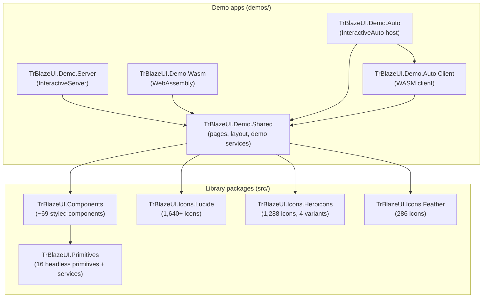
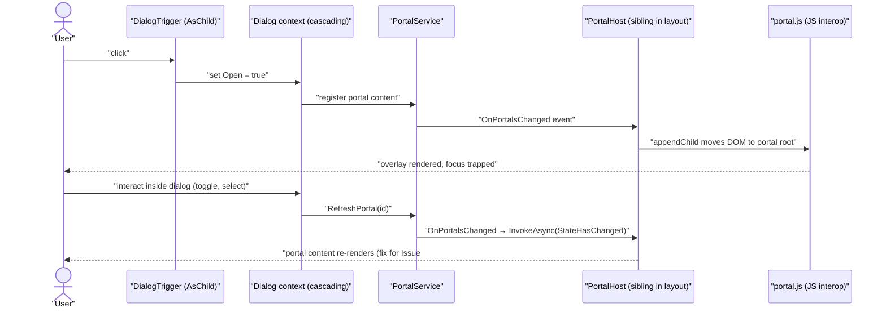
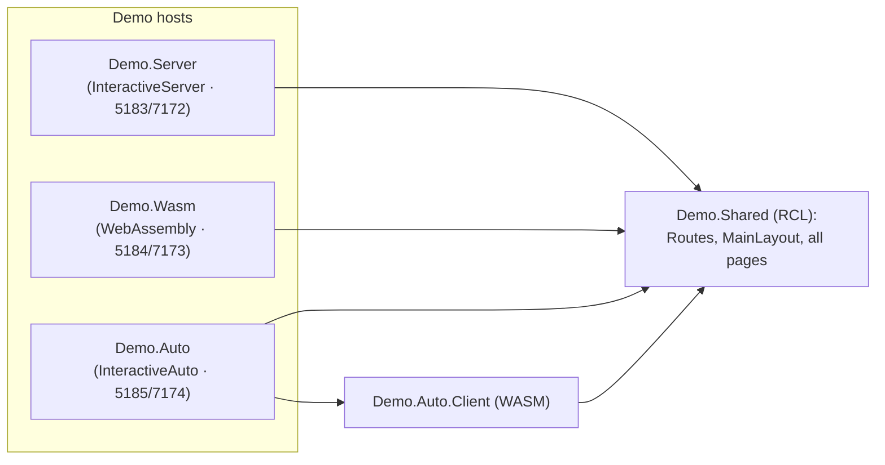
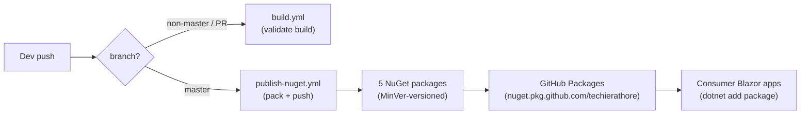

# TrBlazeUI — Architecture

**Last updated:** 2026-06-30
**Status:** Current (brownfield)

> **Depth mandate:** this is a HUMAN document, read as rendered HTML. Module rows in §4 with non-trivial behavior get a prose paragraph beneath the table, and every significant runtime flow beyond §3's primary path gets its own diagram. Source-doc architecture content (from `TrBlazeUI-Doc.md`, the modernization plan, and the consumer issue reports) is carried forward, not summarized away.

> **Mermaid mandate.** Every diagram follows the authoring rules in `.tfcore/templates/v4custom/html-render-shell.md §5.5` — every node/edge/subgraph label is double-quoted; no `end` node ids.

## Table of Contents

1. [Tech stack](#tech-stack)
2. [Component map](#component-map)
3. [Data flow — primary path](#data-flow-primary-path)
4. [Module responsibilities](#module-responsibilities)
5. [Cross-cutting concerns](#cross-cutting-concerns)
6. [Deployment architecture](#deployment-architecture)
7. [Architectural decisions (ADR-style log)](#architectural-decisions-adr-style-log)
8. [Target architecture](#target-architecture)
9. [Open questions / risks](#open-questions-risks)
10. [Sources harvested](#sources-harvested)

## 1. Tech stack

TrBlazeUI is a **Blazor UI component library** (not an application) — a renamed fork of the open-source *Blazor Blueprint* project (original author Mathew Taylor), distributed as NuGet packages and licensed Apache 2.0. It is styled with Tailwind CSS v4 and follows the shadcn/ui design system. There is **no database, no server backend, no authentication, and no AI/RAG layer** — the only runtime artifacts are the library assemblies and three demo host applications.

| Layer | Choice | Version | Notes |
|-------|--------|---------|-------|
| Runtime / SDK | .NET | 10.0 | Upgraded from .NET 8 during the modernization pass (all 10 projects on `net10.0`) |
| Language | C# | 14 | `TreatWarningsAsErrors` + `EnforceCodeStyleInBuild` enabled |
| UI framework | Blazor (Server, WebAssembly, Auto) | .NET 10 | Library is render-mode agnostic; demos exercise all three |
| Component templating | Razor | .NET 10 | Code-behind pattern (`.razor` + `.razor.cs`) |
| Styling | Tailwind CSS | v4 (standalone binary) | Pre-built CSS shipped in the package; `tools/tailwindcss.exe`, no Node.js |
| Color system | CSS custom properties + OKLCH | — | shadcn/ui-compatible; dark mode via `.dark` class on `<html>` |
| Charts | Blazor-ApexCharts | 6.1.0 | Wraps ApexCharts.js for the Chart component |
| Markdown | Markdig | 0.44.0 | Powers MarkdownEditor |
| HTML sanitization | HtmlSanitizer | 9.0.892 | Security layer for RichTextEditor output |
| Versioning | MinVer | 7.0.0 | Per-library semantic versioning from git tag prefixes |
| Blazor packages | Microsoft.AspNetCore.Components.* | 10.0.2 | `.Web`, `.WebAssembly`, `.WebAssembly.DevServer`, `.WebAssembly.Server` |
| Distribution | GitHub Packages (NuGet) | — | `nuget.pkg.github.com/techierathore` |
| AI tooling | TrBlazeUI agent skills | — | `/trblazeui` Claude Code + OpenCode skills in `docs/skills/` |

**Build environment:** the reference machine is WSL-on-Windows; builds run via the Windows dotnet (`cmd.exe /c "dotnet build ..."`) with `-p:CI=true` to skip the Tailwind step (pre-built CSS is committed). This application does **not** support hot-reload — build and restart to test changes.

## 2. Component map

The solution is a **two-layer library** (headless Primitives → styled Components) plus three pluggable Icon packages, consumed by a shared demo Razor Class Library that is hosted in three render-mode-specific demo apps.

## 3. Data flow — primary path

A component library has no request/response data path; its "primary path" is the **interaction + portal-rendering flow** for an overlay component (Dialog, Sheet, Popover, DropdownMenu). The portal mechanism — and the reactive-refresh fix applied after the AppStudio consumer report — is the single most architecturally significant runtime flow.

## 4. Module responsibilities

| Module | Responsibility | Depends on |
|--------|----------------|------------|
| `src/TrBlazeUI.Primitives` | Headless, unstyled, accessible behavior primitives + shared services | (none) |
| `src/TrBlazeUI.Components` | Pre-styled shadcn/ui-compatible components + bundled Tailwind CSS | Primitives, Blazor-ApexCharts, Markdig, HtmlSanitizer |
| `src/TrBlazeUI.Icons.Lucide` | Lucide icon set as a Blazor component + generated data | Components.Web |
| `src/TrBlazeUI.Icons.Heroicons` | Heroicons (outline/solid/mini/micro) component + data | Components.Web |
| `src/TrBlazeUI.Icons.Feather` | Feather icon set component + data | Components.Web |
| `demos/TrBlazeUI.Demo.Shared` | All demo pages, sidebar layout, demo-only services | Components, all 3 Icon libs |
| `demos/TrBlazeUI.Demo.Server` | Blazor Server host (SignalR, fast initial load) | Demo.Shared |
| `demos/TrBlazeUI.Demo.Wasm` | Standalone WebAssembly host | Demo.Shared |
| `demos/TrBlazeUI.Demo.Auto` | Auto render-mode host (server-first, WASM after download) | Demo.Shared, Demo.Auto.Client |
| `demos/TrBlazeUI.Demo.Auto.Client` | WASM client entry point for the Auto host | Demo.Shared |

**`TrBlazeUI.Primitives` — the behavior layer.** This project contains the 16 headless primitives (Accordion, Checkbox, Collapsible, Dialog, DropdownMenu, Floating, HoverCard, Label, Popover, RadioGroup, Select, Sheet, Switch, Table, Tabs, Tooltip), each implementing WCAG 2.1 AA keyboard navigation and ARIA semantics with **zero styling**. Alongside the components it ships the cross-cutting services registered by `AddTrBlazeUIPrimitives()`: `IPortalService`/`PortalService` (moves overlay DOM to a portal root and — post-fix — raises `OnPortalsChanged` so `PortalHost` re-renders on internal state changes), `IPositioningService`/`PositioningService` (Floating-UI-style anchor positioning), `IFocusManager`/`FocusManager` (focus trapping for modals), `IKeyboardShortcutService`/`KeyboardShortcutService` (global shortcut registration, e.g. Ctrl/Cmd+B), and `DropdownManagerService` (single-open-dropdown coordination). State flows parent→child through ~13 cascading context types. Behavior that needs the DOM is delegated to ~10 JS utility files under `wwwroot/js/primitives/` (click-outside, focus-trap, keyboard-nav, portal, positioning, etc.).

**`TrBlazeUI.Components` — the styled layer.** ~69 components (68 catalogued in the structure doc plus the later-added **Toolbar** family) compose the primitives and add Tailwind-based styling driven entirely by CSS variables, so any shadcn/ui or tweakcn theme works unmodified. Components follow a feature-folder layout (each component in its own folder with `.razor` markup, `.razor.cs` logic, and enum/config classes) and a code-behind pattern. Multi-part components compose many sub-components (Dialog = 8 parts, Sidebar = 22, Sheet/DropdownMenu/AlertDialog/Command ≈ 8–9 each). The project bundles the pre-built `trblazeui.css` (~83 KB, compiled by the standalone Tailwind binary from `trblazeui-input.css`) so consumers need no Tailwind toolchain. Rich-content components pull in third-party engines: Chart → Blazor-ApexCharts, MarkdownEditor → Markdig, RichTextEditor → Quill.js (via JS interop) with HtmlSanitizer guarding the HTML output. A key cross-cutting invariant — surfaced by two consumer issue reports and since fixed — is that essentially every component now implements `[Parameter(CaptureUnmatchedValues = true)]` attribute splatting so arbitrary HTML attributes and event handlers (`id`, `style`, `@onkeydown`, …) pass through to the rendered element rather than throwing at runtime.

**Icon packages.** Three independent, separately-versioned packages each expose one Razor component (`LucideIcon`, `HeroIcon`, `FeatherIcon`) backed by an auto-generated `*IconData.cs` of SVG path data. They depend only on `Microsoft.AspNetCore.Components.Web` and are regenerated via the Node/PowerShell scripts under `tools/icon-generation/` (only needed when refreshing the source icon sets).

**`TrBlazeUI.Demo.Shared` + hosts.** The demo is a single Razor Class Library (90+ pages: home, architecture, getting-started, plus per-component / per-primitive / per-chart / per-icon demo pages) hosted by three thin render-mode apps. Demo-only services include `ThemeService` (light/dark + theme switching), `CollapsibleStateService` (sidebar persistence via localStorage), `MockDataService` (sample data for DataTable/Chart demos), and `LayoutService`/`LayoutToggle`/`HorizontalNav` (horizontal vs vertical nav, added during modernization). This split deliberately demonstrates that the same component code renders identically across Server, WASM, and Auto.

### Render-mode hosting flow

Each demo host wires the same shared component tree behind a different Blazor render mode. The Auto host is the only multi-project one (server host + WASM client sharing `Demo.Shared`).

## 5. Cross-cutting concerns

- **Accessibility (primary cross-cutting concern)** — WCAG 2.1 AA across all primitives/components: keyboard navigation, ARIA roles/states, focus management, focus trapping for overlays. Realized via `AriaBuilder`, `KeyboardNavigator`, `IdGenerator` utilities in Primitives and the `FocusManager` service.
- **Theming** — CSS custom properties (shadcn/ui variable set) in OKLCH color space; light/dark via the `.dark` class on `<html>`; consumers supply a `theme.css` loaded *before* `trblazeui.css`.
- **Portal / overlay management** — `PortalService` + `PortalHost` + `portal.js` move overlay DOM to a portal root; reactive refresh added so internal state changes propagate (consumer-reported fix).
- **JS interop** — ~12 component JS files (file-upload, markdown-editor, masked-input, multiselect, navigation-menu, quill-interop, range-slider, resizable, responsive-nav, sidebar, slider, virtualization-scroll) + ~10 primitive JS files (click-outside, element-utils, focus-trap, keyboard-nav, keyboard-shortcuts, match-trigger-width, portal, positioning, select, table-row-nav).
- **Attribute splatting** — `CaptureUnmatchedValues` on (now) essentially all components so HTML attributes/events forward through (standard Blazor library pattern; retrofitted after consumer reports).
- **Logging / error handling / telemetry** — none beyond Blazor defaults; this is a UI library, not a service. Error handling follows the standards (specific catches, `throw;`, no bare catch).
- **Versioning** — MinVer per-package from git tag prefixes (`components/v`, `primitives/v`, `icons-lucide/v`, `icons-heroicons/v`, `icons-feather/v`).
- **Code quality enforcement** — `TreatWarningsAsErrors`, `EnforceCodeStyleInBuild`, `AnalysisLevel=latest-recommended`, `GenerateDocumentationFile=true`, nullable enabled — solution-wide via `Directory.Build.props`.

## 6. Deployment architecture

There is no server deployment. "Deployment" means **publishing NuGet packages** to GitHub Packages via GitHub Actions, plus running the demo apps locally.

- **`publish-nuget.yml`** — on push to `master`, on `windows-latest`, full git history for MinVer, builds Release with `-p:CI=true`, packs all 5 library projects, pushes with `--skip-duplicate` using `GITHUB_TOKEN`.
- **`build.yml`** — validation build on non-master pushes and PRs to master.
- **Local run** — `./scripts/run-demo.sh [server|wasm|auto]` or `dotnet run --project demos/TrBlazeUI.Demo.<mode>`. Per-package release scripts live under `scripts/` (`release-components.sh`, `release-primitives.sh`, `release-icons-*.sh`).

## 7. Architectural decisions (ADR-style log)

- **ADR-001 — Current stack as-is (reverse-doc baseline).** .NET 10 / Blazor / Tailwind v4 / shadcn-compatible CSS-variable theming, distributed as NuGet packages. Established by the original fork and the modernization pass.
- **ADR-002 — Two-layer headless + styled architecture.** Primitives provide behavior + accessibility; Components add styling. Lets consumers either drop in styled components or build custom UIs on headless primitives. Reason: mirror Radix UI / shadcn/ui separation of concerns.
- **ADR-003 — Ship pre-built CSS, not a Tailwind dependency.** The standalone Tailwind binary compiles `trblazeui.css` at build time and the output is committed/packaged, so consumers need zero Tailwind/Node tooling ("zero configuration"). `-p:CI=true` skips the compile when the binary is unavailable.
- **ADR-004 — CSS-variable theming over baked-in colors.** All colors/spacing via CSS custom properties so any shadcn/ui or tweakcn theme works unmodified, with runtime light/dark switching.
- **ADR-005 — Per-package independent MinVer versioning.** Each library version is derived from its own git tag prefix, so icon packages and core libraries release independently.
- **ADR-006 — Universal attribute splatting (`CaptureUnmatchedValues`).** Retrofitted across components after consumer apps hit runtime `InvalidOperationException` passing standard HTML attributes; now the default pattern for every component.
- **ADR-007 — Reactive portal refresh.** `PortalService.RefreshPortal` + `OnPortalsChanged` so `PortalHost` (a layout sibling, not a descendant) re-renders on internal overlay state changes. Reason: fix the AppStudio-reported "static dialog" blocker.
- **ADR-008 — GitHub Packages distribution under `techierathore`.** Chosen over nuget.org for the rename/beta phase; consumers configure a PAT-authenticated source.
- **ADR-009 — Rename BlazorUI/BlazorBlueprint → TrBlazeUI.** Namespaces, package names, CSS file, and service-registration method all renamed for the v2.0 fork; NOTICE retains original attribution per Apache 2.0.

## 8. Target architecture

No structural change is in flight. The library is feature-complete for its current scope; future work is incremental (new components, broader XML-doc coverage, consumer-feedback fixes) rather than re-architecture. If a documentation/runtime change is later proposed, capture it here as a delta with a diagram.

## 9. Open questions / risks

- **XML-documentation coverage — RESOLVED (2026-06-30).** Coverage is now 100%: all public members (including enums, DTOs, demo services, and Blazor lifecycle overrides) are documented, and the `CS1591` suppression has been removed from `Directory.Build.props`, so missing docs now fail the build. No remaining standards-debt on docs.
- **Field-prefix convention — RESOLVED.** Static analysis confirms the `obj`-prefix instance-field style dominates (`objLogger`, `objJsRuntime`, `objModule`, …) and the modernization pass reports 0 underscore-prefixed fields remaining. §4 / Coding Standards adopt `obj` prefix. No drift remediation needed.
- **NativeSelect inside MAUI Blazor Hybrid overlays.** A genuine WebView2/MAUI *platform* limitation (native `<select>` popup clipped in `position: fixed` overlays) — no library fix possible; guidance is to use `<Select>` instead. Carries forward as a documented known limitation, not a defect.
- **`.NET 8` vs `.NET 10` references in older docs.** The reverse-doc baseline is .NET 10 (modernization complete). Any lingering `.NET 8` mention in harvested source docs is stale; the canonical answer is .NET 10 / C# 14.
- **MinVer tag warnings.** Expected when building without git tags present; not a defect.
- **Demo data is mock-only.** DataTable/Chart demos use `MockDataService`; there is no persistence layer to reason about.

## 10. Sources harvested

- `docs/TrBlazeUI-Doc.md` — overview, solution structure, tech-stack tables, project tree, service registration.
- `docs/TrBlazeUI-Update-plan.md` — modernization work streams (.NET 10 upgrade, CI/CD, AI reference, skills), completion statuses.
- `docs/toolbarplan.md` — Toolbar component design (now implemented).
- `docs/TrBlazeUI-Issues-Report-1.md`, `docs/trblazeui-issues-report-2.md` — consumer-reported bugs (portal refresh, attribute splatting, CSS path) and their fixes.
- `README.md`, `THEMING.md` — theming, installation, render-mode, AI-skill, and migration content.
- `docs/Coding-Standards.md` — naming/field conventions baseline.

---
Last updated: 2026-06-30
