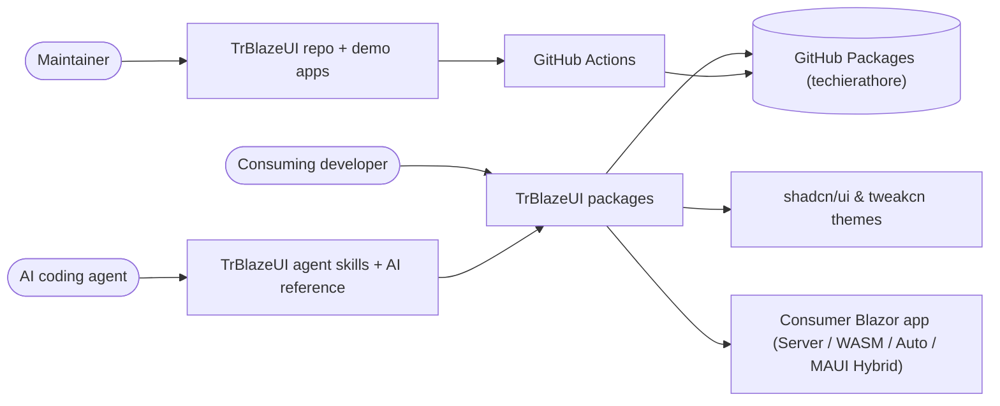
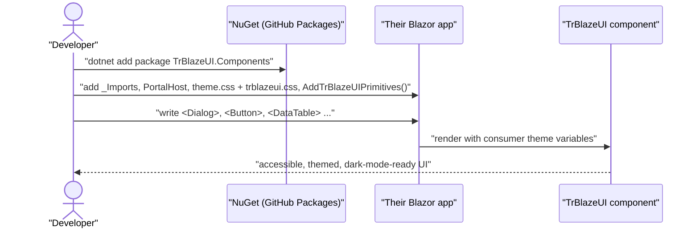
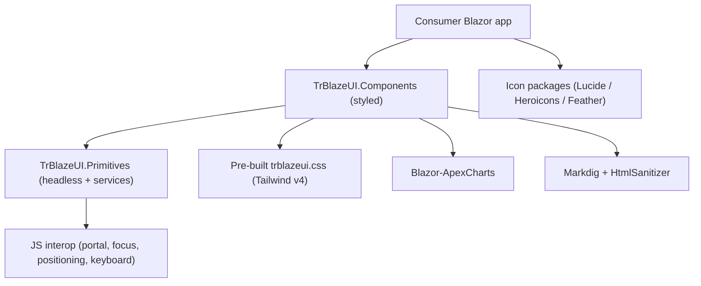
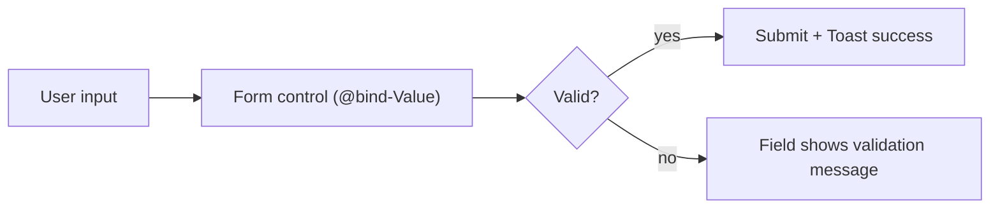
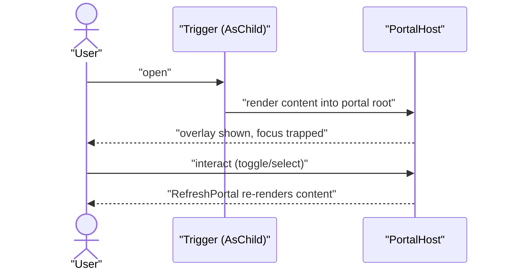

# TrBlazeUI — Business Requirements

> Stable IDs: every requirement has a BRD-{N} ID. IDs are append-only across revisions.

> **Depth mandate.** This is a HUMAN document, read as rendered HTML by the product owner. It is NOT the coding checklist (`docs/TrBlazeUI-Checklist.md`). One-line entries belong ONLY in §10's ledger. §9 Feature catalog is the heart of the doc. This BRD is an information-preserving superset of the harvested source docs (`TrBlazeUI-Doc.md`, the modernization plan, the toolbar plan, the two consumer issue reports, README, THEMING).

> **Mermaid mandate.** Every diagram follows `.tfcore/templates/v4custom/html-render-shell.md §5.5` — every label double-quoted; no `end` node ids.

## Table of Contents

1. [Executive summary](#executive-summary)
2. [Business objectives](#business-objectives)
3. [Scope](#scope)
4. [Development status](#development-status)
5. [Stakeholders / users](#stakeholders-users)
6. [Context diagram](#context-diagram)
7. [User journey — primary use case](#user-journey-primary-use-case)
8. [Component sketch](#component-sketch)
9. [Feature catalog](#feature-catalog)
   - [F-PRIM: Headless primitives](#f-prim-headless-primitives)
   - [F-FORM: Form components](#f-form-form-components)
   - [F-LAYOUT: Layout & navigation components](#f-layout-layout-navigation-components)
   - [F-OVERLAY: Overlay & feedback components](#f-overlay-overlay-feedback-components)
   - [F-DATA: Data & content components](#f-data-data-content-components)
   - [F-DISPLAY: Display components](#f-display-display-components)
   - [F-TOOLBAR: Toolbar component](#f-toolbar-toolbar-component)
   - [F-CHART: Charts](#f-chart-charts)
   - [F-ICONS: Icon libraries](#f-icons-icon-libraries)
   - [F-THEME: Theming & dark mode](#f-theme-theming-dark-mode)
   - [F-A11Y: Accessibility](#f-a11y-accessibility)
   - [F-DEMO: Demo applications](#f-demo-demo-applications)
   - [F-DIST: Packaging & distribution](#f-dist-packaging-distribution)
   - [F-AI: AI agent skills](#f-ai-ai-agent-skills)
10. [Functional requirements (BRD ledger)](#functional-requirements-brd-ledger)
11. [Non-functional requirements](#non-functional-requirements)
12. [Constraints & assumptions](#constraints-assumptions)
13. [Success metrics](#success-metrics)
14. [Risks](#risks)
15. [Glossary](#glossary)

## 1. Executive summary

**TrBlazeUI** is a comprehensive, production-ready **Blazor UI component library** for .NET 10 that brings the shadcn/ui design system to Blazor. It is a renamed fork of the open-source *Blazor Blueprint* project (Apache 2.0), restructured into a layered architecture: **16 headless, accessible primitives** at the base and **~69 pre-styled components** on top, complemented by **three icon packages** (Lucide, Heroicons, Feather; 3,200+ icons total). It ships pre-built Tailwind CSS so consumers need no Node.js or Tailwind toolchain ("zero configuration"), is 100% compatible with shadcn/ui and tweakcn themes, and works identically across all three Blazor hosting models — Server, WebAssembly, and Auto.

The product solves a real gap: Blazor developers have lacked a modern, system-first UI library equivalent to React's shadcn/ui. TrBlazeUI fills it with WCAG 2.1 AA-accessible components, built-in light/dark theming via CSS variables, and a familiar React-inspired API (`@bind-Value`, `AsChild`, composition over inheritance). The library is distributed as NuGet packages via GitHub Packages and is consumed by real downstream applications (e.g. an AppStudio IDE and a TechieRag web sample), whose feedback has driven hardening fixes.

This document captures, for the product owner, what TrBlazeUI delivers today (the bulk of which is **built and shipping** following a .NET 8→10 modernization pass) and the small set of open enhancements. Because the codebase is brownfield, §4 is the first thing to read: it states feature-by-feature what is Done versus pending.

## 2. Business objectives

- Provide Blazor developers a **drop-in, shadcn/ui-equivalent component library** so they don't design accessible UI components from scratch.
- Guarantee **zero-configuration adoption** — pre-built CSS, no Tailwind/Node setup, works in Server/WASM/Auto unchanged.
- Achieve **WCAG 2.1 AA accessibility** as a baseline for every interactive component.
- Be **100% theme-compatible** with the existing shadcn/ui and tweakcn ecosystems.
- Enable **AI-assisted UI generation** by shipping agent skills + a component reference so Claude Code / OpenCode can scaffold TrBlazeUI UIs.
- Maintain a **clean, modern, standards-compliant codebase** (.NET 10, C# 14, strict warnings-as-errors, mandatory XML docs) suitable for long-term maintenance and confident downstream consumption.

## 3. Scope

**In scope:**
- Headless primitive components (behavior + accessibility, unstyled).
- Pre-styled components matching shadcn/ui across forms, layout, navigation, overlays, feedback, data display, rich content (charts, markdown/rich-text editors), and a desktop-style toolbar.
- Three icon-library packages.
- CSS-variable theming with light/dark mode and shadcn/tweakcn compatibility.
- A demo application in all three render modes showcasing every component.
- NuGet packaging + GitHub Packages CI/CD distribution.
- AI agent skills (Claude Code + OpenCode) and a component reference document.

**Out of scope (explicit):**
- Any backend, database, persistence, or server API (this is a UI library).
- Authentication / authorization / user management.
- AI/RAG runtime features inside the library (TechieRag is a *consumer*, not a dependency).
- A hosted public documentation website (the demo app is the reference; doc-site links are TODO).
- Mobile-native (MAUI) component variants — MAUI Blazor Hybrid is a *consumer host*, and one known platform limitation (NativeSelect in overlays) is documented, not fixed in the library.
- Publishing to nuget.org (currently GitHub Packages under `techierathore`).

## 4. Development status

<!-- Feature-level snapshot. Live per-REQ status: PROJECT-STATUS.md + docs/TrBlazeUI-Checklist.md. -->

**Snapshot as of 2026-06-30.** Live, per-requirement status: see `PROJECT-STATUS.md` and the **Requirements Status** table in `docs/TrBlazeUI-Checklist.md`. Status is derived from the migrated modernization/toolbar plans (both fully delivered) and a static scan of the as-built codebase.

| Feature (F-code) | Phase | Status | % | Notes |
|------------------|-------|--------|---|-------|
| F-PRIM: Headless primitives | Pre-existing | Done | 100 | 16 primitives + portal/focus/keyboard/positioning services |
| F-FORM: Form components | Pre-existing | Done | 100 | ~28 form components incl. pickers, OTP, masked, multiselect |
| F-LAYOUT: Layout & navigation | Pre-existing | Done | 100 | Sidebar (22 parts), nav menu, tabs, breadcrumb, pagination, resizable |
| F-OVERLAY: Overlay & feedback | Pre-existing | Done | 100 | Dialog, Sheet, Drawer, Popover, Toast, Tooltip, Command, menus |
| F-DATA: Data & content | Pre-existing | Done | 100 | DataTable, MarkdownEditor, RichTextEditor |
| F-DISPLAY: Display components | Pre-existing | Done | 100 | Avatar, Badge, Alert, Progress, Skeleton, Spinner, Typography, etc. |
| F-TOOLBAR: Toolbar | Pre-existing | Done | 100 | Toolbar + Group/Button/ToggleButton/Separator (per toolbar plan) |
| F-CHART: Charts | Pre-existing | Done | 100 | 6 chart types via Blazor-ApexCharts |
| F-ICONS: Icon libraries | Pre-existing | Done | 100 | Lucide / Heroicons / Feather (3,200+ icons) |
| F-THEME: Theming & dark mode | Pre-existing | Done | 100 | CSS variables, OKLCH, shadcn/tweakcn compatible, `.dark` toggle |
| F-A11Y: Accessibility | Pre-existing | Done | 90 | WCAG 2.1 AA patterns library-wide; not independently audited |
| F-DEMO: Demo applications | Pre-existing | Done | 100 | 90+ pages across Server / WASM / Auto |
| F-DIST: Packaging & distribution | Pre-existing | Done | 100 | MinVer, 5 packages, GitHub Actions → GitHub Packages |
| F-AI: AI agent skills | Pre-existing | Done | 100 | Claude Code + OpenCode skills + AI reference doc |
| (cross-cutting) XML documentation | Pre-existing | Done | 100 | All public members documented; CS1591 suppression removed (now build-enforced) |

**Legend:** **Done** = shipped & working · **In progress** = actively being built · **Partial** = some sub-features done · **Planned** = not started. (Maps to checklist `Done (pre-existing)` / `In Progress` / `PARTIAL` / `Not Started`.)

> Note (resolved 2026-06-30): the strict Release build is now clean (0 warnings / 0 errors). The IDE0031 analyzer errors in the Sidebar component were event-accessor null guards where `?.` is illegal (CS0131), resolved via a justified one-rule `.editorconfig` downgrade; XML-doc coverage was completed to 100% and the CS1591 suppression removed. All features are `Done` and the build is green.

## 5. Stakeholders / users

TrBlazeUI has no end-user accounts — its "users" are **developers** who consume the library, plus the maintainers. There is no authentication or role system anywhere in the product.

| Role | Needs |
|------|-------|
| **Consuming Blazor developer** | Install packages, add CSS + `PortalHost`, compose components, theme the app, ship accessible UI fast without Tailwind setup. |
| **Library maintainer / contributor** | Build the solution, follow coding standards, add/maintain components, run the demo to verify, publish packages. |
| **AI coding agent (Claude Code / OpenCode)** | Read the AI reference + skills, generate correct TrBlazeUI Razor (pages, forms, dashboards) using the right components and binding patterns. |
| **Downstream app teams (e.g. AppStudio IDE, TechieRag web sample)** | Depend on the packages, report issues, receive fixes; some run inside MAUI Blazor Hybrid (WebView2). |
| **Theme author** | Drop shadcn/ui or tweakcn CSS variables into `theme.css` and have every component adopt them, including dark mode. |

**Persona detail — Consuming developer onboarding path:** (1) create a GitHub PAT with `read:packages`; (2) add the `techierathore` GitHub Packages NuGet source; (3) `dotnet add package TrBlazeUI.Components` (+ optional Primitives/Icons); (4) add `@using` lines to `_Imports.razor`; (5) add `<PortalHost />` to the root layout; (6) link `theme.css` then `trblazeui.css` in `App.razor`; (7) register services (`AddTrBlazeUIPrimitives()`, `AddScoped<ToastService>()`); (8) start composing components.

## 6. Context diagram

## 7. User journey — primary use case

The primary journey is a developer adding TrBlazeUI to an existing Blazor app and rendering a themed, accessible component.

## 8. Component sketch

## 9. Feature catalog

### F-PRIM: Headless primitives

**Personas:** Consuming developer (custom-UI builders) · **Phase:** Pre-existing (Done)

Sixteen headless, unstyled primitive components provide behavior, keyboard navigation, and ARIA semantics with no styling, so developers can build fully custom-styled UIs while inheriting accessibility. They are also the foundation the styled Components layer composes. Backing them are shared services (Portal, Positioning, Focus, Keyboard, Dropdown manager) registered by `AddTrBlazeUIPrimitives()`.

| Surface | Route (demo) | Description |
|--------|-------|-------------|
| Primitives overview | `/primitives` | Index of all primitives |
| Per-primitive demos | `/primitives/*` | Accordion, Checkbox, Collapsible, Dialog, DropdownMenu, HoverCard, Label, Popover, RadioGroup, Select, Sheet, Switch, Table, Tabs, Tooltip |

**Primitives:** Accordion, Checkbox, Collapsible, Dialog, DropdownMenu, Floating, HoverCard, Label, Popover, RadioGroup, Select, Sheet, Switch, Table, Tabs, Tooltip.

**Workflow:** 1) consumer installs `TrBlazeUI.Primitives`; 2) registers services; 3) composes a primitive and supplies their own classes/styles; 4) primitive handles keyboard/focus/ARIA + portal positioning.

**Requirements:** BRD-1, BRD-2, BRD-3 (see §10)

### F-FORM: Form components

**Personas:** Consuming developer · **Phase:** Pre-existing (Done)

~28 pre-styled form controls covering text entry, selection, dates/times, numeric/currency, file upload, ratings, toggles, and grouping — all with two-way binding (`@bind-Value`/`@bind-Checked`) and Blazor form-validation compatibility.

| Component (representative) | Description |
|--------|-------------|
| Button, ButtonGroup | Variants (Default/Destructive/Outline/Secondary/Ghost/Link), sizes, icon support; `ButtonIcon` wrapper avoids RZ10012 |
| Input, Textarea, Label, Field | Text entry + accessible labeling/help/validation grouping; attribute splatting for `style`/events |
| Checkbox, Switch, RadioGroup, Toggle, ToggleGroup | Binary / single-select toggles |
| Select, NativeSelect, Combobox, MultiSelect | Dropdown selection (custom + native + searchable + multi) |
| Calendar, DatePicker, DateRangePicker, TimePicker | Date/time selection |
| NumericInput, CurrencyInput, MaskedInput, InputOTP, InputGroup | Specialized inputs |
| Slider, RangeSlider, Rating, ColorPicker, FileUpload | Range, rating, color, drag-and-drop upload |

**Workflow:** compose control → bind value → optional `Field` wrapper for label/validation → submit with `Button` → feedback via `ToastService`.

**Requirements:** BRD-4 … BRD-12 (see §10)

### F-LAYOUT: Layout & navigation components

**Personas:** Consuming developer · **Phase:** Pre-existing (Done)

Structural and navigation components for app shells: a feature-rich **Sidebar** (22 sub-components; collapsible icon mode, floating/inset variants, mobile sheet integration, Ctrl/Cmd+B toggle, cookie/localStorage persistence), plus Card, AspectRatio, Resizable, ScrollArea, Separator, Accordion, Collapsible, Item, and navigation (Breadcrumb, NavigationMenu, Menubar, Pagination, ResponsiveNav, Tabs).

| Component | Description |
|--------|-------------|
| Sidebar | Responsive collapsible sidebar with variants + mobile sheet |
| NavigationMenu, Menubar, Breadcrumb, Pagination, ResponsiveNav, Tabs | Navigation primitives (horizontal nav uses FloatingPortal to fix overflow) |
| Card, Resizable, ScrollArea, AspectRatio, Separator, Item | Layout containers |

**Requirements:** BRD-13 … BRD-18 (see §10)

### F-OVERLAY: Overlay & feedback components

**Personas:** Consuming developer · **Phase:** Pre-existing (Done)

Floating/overlay components rendered through the **portal** system (Dialog, AlertDialog, Sheet, Drawer, Popover, HoverCard, Tooltip, DropdownMenu, ContextMenu, Menubar, Command) plus Alert and Toast feedback. The portal was hardened with reactive refresh so internal state changes re-render correctly (consumer-reported blocker, fixed).

| Component | Description |
|--------|-------------|
| Dialog, AlertDialog, Sheet, Drawer | Modal/side overlays via PortalHost with focus trap |
| Popover, HoverCard, Tooltip, DropdownMenu, ContextMenu, Command | Floating panels / menus / command palette |
| Alert, Toast | Inline callouts + transient notifications (`ToastService.ShowSuccess/Error/Warning/Info`) |

**Workflow (overlay):** trigger (often `AsChild`) opens overlay → content rendered into portal root → focus trapped → internal interactions refresh the portal → close restores focus.

**Requirements:** BRD-19 … BRD-24 (see §10)

### F-DATA: Data & content components

**Personas:** Consuming developer · **Phase:** Pre-existing (Done)

Powerful data and rich-content editors: **DataTable** (sorting, filtering, pagination, selection, toolbar, column config), **MarkdownEditor** (Markdig-powered, toolbar + live preview), and **RichTextEditor** (Quill.js WYSIWYG with HtmlSanitizer-guarded HTML output).

| Component | Description |
|--------|-------------|
| DataTable | Column/SelectionMode/Toolbar; sortable, filterable, paginated, selectable |
| MarkdownEditor | Markdown editing + preview |
| RichTextEditor | WYSIWYG with sanitized HTML output |

**Requirements:** BRD-25, BRD-26, BRD-27 (see §10)

### F-DISPLAY: Display components

**Personas:** Consuming developer · **Phase:** Pre-existing (Done)

Presentational components: Avatar, Badge, Empty, Item, Kbd, Progress, Skeleton, Spinner, Typography. Several were hardened to forward `style`/`id`/`data-*` via attribute splatting after consumer reports.

**Requirements:** BRD-28, BRD-29 (see §10)

### F-TOOLBAR: Toolbar component

**Personas:** Consuming developer (desktop/hybrid apps) · **Phase:** Pre-existing (Done)

A compound **Toolbar** for desktop/hybrid Blazor apps (Visual-Studio-style action bars): `Toolbar` container (Default/Compact/Dense density, horizontal/vertical) with `ToolbarGroup`, `ToolbarButton`, `ToolbarToggleButton` (`@bind-IsPressed`), and `ToolbarSeparator`. Full `role="toolbar"` / `aria-pressed` accessibility; composes existing Button/DropdownMenu/Select as children.

| Surface | Route (demo) | Description |
|--------|-------|-------------|
| Toolbar demo | `/components/toolbar` | Basic, grouped, variants, toggle, dropdowns, vertical, IDE/editor examples |

**Workflow:** compose `Toolbar` → add `ToolbarGroup`s of `ToolbarButton`/`ToolbarToggleButton` → divide with `ToolbarSeparator` → wire click/toggle handlers.

**Requirements:** BRD-30, BRD-31 (see §10)

### F-CHART: Charts

**Personas:** Consuming developer · **Phase:** Pre-existing (Done)

Six chart types (Area, Bar, Line, Pie, Radar, Radial) built on Blazor-ApexCharts, themed via the chart CSS variables (`--chart-1..5`).

| Surface | Route (demo) | Description |
|--------|-------|-------------|
| Chart demos | `/charts/*` | Area, Bar, Line, Pie, Radar, Radial |

**Requirements:** BRD-32 (see §10)

### F-ICONS: Icon libraries

**Personas:** Consuming developer · **Phase:** Pre-existing (Done)

Three independent, separately-versioned icon packages, 3,200+ icons total: Lucide (1,640+, ISC), Heroicons (1,288 across outline/solid/mini/micro, MIT), Feather (286, MIT). Each exposes one strongly-typed Razor component.

| Library | Component | Count / variants |
|--------|-----------|------------------|
| Lucide | `LucideIcon` | 1,640+ |
| Heroicons | `HeroIcon` | 1,288 (4 variants) |
| Feather | `FeatherIcon` | 286 |

**Requirements:** BRD-33, BRD-34 (see §10)

### F-THEME: Theming & dark mode

**Personas:** Consuming developer, theme author · **Phase:** Pre-existing (Done)

100% shadcn/ui + tweakcn theme compatibility via CSS custom properties in OKLCH color space. Consumers drop variables into `theme.css` (loaded before `trblazeui.css`); dark mode toggles by adding/removing `.dark` on `<html>`. Pre-built CSS means no Tailwind setup.

**Requirements:** BRD-35, BRD-36, BRD-37 (see §10)

### F-A11Y: Accessibility

**Personas:** All end-users of consumer apps · **Phase:** Pre-existing (Done, not independently audited)

WCAG 2.1 AA across interactive components: keyboard navigation, ARIA roles/states, focus management + trapping, screen-reader support, keyboard shortcuts.

**Requirements:** BRD-38, BRD-39 (see §10)

### F-DEMO: Demo applications

**Personas:** Maintainer, evaluating developer · **Phase:** Pre-existing (Done)

A shared demo RCL (90+ pages) hosted in three render modes (Server 5183/7172, WASM 5184/7173, Auto 5185/7174) demonstrating every component, primitive, chart, and icon set, plus architecture and getting-started pages and a horizontal/vertical layout toggle. Run via `./scripts/run-demo.sh` or `dotnet run`.

**Requirements:** BRD-40, BRD-41 (see §10)

### F-DIST: Packaging & distribution

**Personas:** Maintainer · **Phase:** Pre-existing (Done)

Five NuGet packages with per-package MinVer versioning, published to GitHub Packages (`techierathore`) by GitHub Actions (`publish-nuget.yml` on master; `build.yml` validates PRs). `Directory.Build.props` centralizes metadata, Apache-2.0 license, repo URLs, and strict build settings. NOTICE preserves original attribution.

**Requirements:** BRD-42, BRD-43, BRD-44 (see §10)

### F-AI: AI agent skills

**Personas:** AI coding agent + their developer · **Phase:** Pre-existing (Done)

Claude Code (`/trblazeui`) and OpenCode agent skills (distributable copies in `docs/skills/`) turn an AI assistant into a TrBlazeUI-aware .NET/Blazor developer (integrate, generate page/form/dashboard/component/service, setup-theme, list-components), backed by the `TrBlazeUI-AI-Reference.md` component reference.

**Requirements:** BRD-45, BRD-46, BRD-47 (see §10)

## 10. Functional requirements (BRD ledger)

- **BRD-1** — A developer can install and register the headless primitives via `AddTrBlazeUIPrimitives()`. *(F-PRIM)* <!-- from: TrBlazeUI-Doc.md -->
- **BRD-2** — Each of the 16 primitives provides keyboard navigation and ARIA semantics with no styling. *(F-PRIM)*
- **BRD-3** — A developer can style any primitive with Tailwind, CSS modules, or inline styles. *(F-PRIM)*
- **BRD-4** — A developer can render Buttons with variants (Default/Destructive/Outline/Secondary/Ghost/Link), sizes, and icons. *(F-FORM)*
- **BRD-5** — A developer can two-way bind text inputs (Input, Textarea) and pass arbitrary HTML attributes/events to them. *(F-FORM)*
- **BRD-6** — A developer can use selection controls: Checkbox, Switch, RadioGroup, Toggle, ToggleGroup. *(F-FORM)*
- **BRD-7** — A developer can use dropdown selection: Select, NativeSelect, Combobox, MultiSelect. *(F-FORM)*
- **BRD-8** — A developer can pick dates/times via Calendar, DatePicker, DateRangePicker, TimePicker. *(F-FORM)*
- **BRD-9** — A developer can capture numeric/currency/masked/OTP input via NumericInput, CurrencyInput, MaskedInput, InputOTP, InputGroup. *(F-FORM)*
- **BRD-10** — A developer can use Slider, RangeSlider, and Rating controls. *(F-FORM)*
- **BRD-11** — A developer can pick colors via ColorPicker and upload files via drag-and-drop FileUpload. *(F-FORM)*
- **BRD-12** — A developer can compose accessible forms with Field (label, control, help text, validation message). *(F-FORM)*
- **BRD-13** — A developer can build an app shell with a responsive, collapsible Sidebar (variants + mobile sheet + Ctrl/Cmd+B toggle). *(F-LAYOUT)*
- **BRD-14** — The Sidebar persists its collapsed state across sessions. *(F-LAYOUT)*
- **BRD-15** — A developer can build navigation with Breadcrumb, NavigationMenu, Menubar, Pagination, ResponsiveNav, Tabs. *(F-LAYOUT)*
- **BRD-16** — A developer can lay out content with Card, Resizable, ScrollArea, AspectRatio, Separator, Item. *(F-LAYOUT)*
- **BRD-17** — A developer can group collapsible content with Accordion and Collapsible. *(F-LAYOUT)*
- **BRD-18** — Horizontal navigation dropdowns render without overflow clipping (FloatingPortal). *(F-LAYOUT)*
- **BRD-19** — A developer can show modal overlays (Dialog, AlertDialog) with focus trap and ARIA. *(F-OVERLAY)*
- **BRD-20** — A developer can show side panels (Sheet on any edge, Drawer). *(F-OVERLAY)*
- **BRD-21** — A developer can show floating panels and menus (Popover, HoverCard, Tooltip, DropdownMenu, ContextMenu, Menubar). *(F-OVERLAY)*
- **BRD-22** — A developer can show a command palette (Command) with keyboard navigation and filtering. *(F-OVERLAY)*
- **BRD-23** — Internal state changes inside an overlay re-render correctly through the reactive portal. *(F-OVERLAY)* <!-- from: TrBlazeUI-Issues-Report-1.md -->
- **BRD-24** — A developer can show inline Alerts and transient Toasts via ToastService (success/error/warning/info). *(F-OVERLAY)*
- **BRD-25** — A developer can render a DataTable with sorting, filtering, pagination, selection, and a toolbar. *(F-DATA)*
- **BRD-26** — A developer can edit markdown with a toolbar and live preview (MarkdownEditor). *(F-DATA)*
- **BRD-27** — A developer can edit rich text (RichTextEditor) with sanitized HTML output. *(F-DATA)*
- **BRD-28** — A developer can display Avatar, Badge, Empty, Item, Kbd, Progress, Skeleton, Spinner. *(F-DISPLAY)*
- **BRD-29** — A developer can apply consistent text styling via Typography variants (H1–H4, P, Lead, Large, Small, Muted). *(F-DISPLAY)*
- **BRD-30** — A developer can build a desktop-style Toolbar (Default/Compact/Dense, horizontal/vertical) with groups and separators. *(F-TOOLBAR)* <!-- from: toolbarplan.md -->
- **BRD-31** — A developer can use ToolbarButton and toggle-able ToolbarToggleButton (`@bind-IsPressed`). *(F-TOOLBAR)*
- **BRD-32** — A developer can render Area, Bar, Line, Pie, Radar, and Radial charts themed via chart CSS variables. *(F-CHART)*
- **BRD-33** — A developer can render icons from Lucide, Heroicons (4 variants), and Feather via typed components. *(F-ICONS)*
- **BRD-34** — Icon packages are installable independently and versioned separately. *(F-ICONS)*
- **BRD-35** — A developer can theme the whole app with shadcn/ui or tweakcn CSS variables in `theme.css`. *(F-THEME)*
- **BRD-36** — A developer can toggle dark mode by adding/removing `.dark` on `<html>`. *(F-THEME)*
- **BRD-37** — Components require no Tailwind/Node setup (pre-built CSS shipped). *(F-THEME)*
- **BRD-38** — Every interactive component meets WCAG 2.1 AA keyboard + ARIA expectations. *(F-A11Y)*
- **BRD-39** — Overlays trap and restore focus correctly. *(F-A11Y)*
- **BRD-40** — A maintainer can run a demo app in Server, WASM, or Auto mode showing every component. *(F-DEMO)*
- **BRD-41** — A user can switch the demo between horizontal and vertical navigation layouts. *(F-DEMO)*
- **BRD-42** — A maintainer can publish all 5 packages to GitHub Packages via GitHub Actions on master. *(F-DIST)*
- **BRD-43** — Each package is versioned independently from its own git tag prefix (MinVer). *(F-DIST)*
- **BRD-44** — A consumer can install packages from the `techierathore` GitHub Packages source with a PAT. *(F-DIST)*
- **BRD-45** — An AI agent can be activated as `/trblazeui` (Claude Code) or the OpenCode equivalent. *(F-AI)*
- **BRD-46** — The AI agent can integrate TrBlazeUI into an app and generate pages/forms/dashboards/components/services/themes. *(F-AI)*
- **BRD-47** — The AI agent draws on `TrBlazeUI-AI-Reference.md` for component parameters and patterns. *(F-AI)*

## 11. Non-functional requirements

- **BRD-48** — Performance: pre-built minified CSS (~83 KB); components render identically across Server/WASM/Auto with no per-component JS bundle bloat.
- **BRD-49** — Security: RichTextEditor HTML output is sanitized via HtmlSanitizer; no credentials or secrets in the library; consumers keep PATs out of source control.
- **BRD-50** — Accessibility: WCAG 2.1 AA baseline (keyboard, ARIA, focus, screen reader) for all interactive components.
- **BRD-51** — Compatibility: 100% shadcn/ui + tweakcn theme compatibility; works on .NET 10 across all three Blazor render modes; usable from MAUI Blazor Hybrid (with the documented NativeSelect-in-overlay caveat).
- **BRD-52** — Maintainability: .NET 10 / C# 14, `TreatWarningsAsErrors`, `EnforceCodeStyleInBuild`, mandatory XML docs on public members, one-class-per-file, file-scoped namespaces, `obj`-prefixed instance fields.
- **BRD-53** — Reliability: every component implements `CaptureUnmatchedValues` so arbitrary HTML attributes/events never cause runtime `InvalidOperationException`.

| NFR area | Target |
|----------|--------|
| Pre-built CSS size | ~83 KB minified |
| Render modes supported | Server, WebAssembly, Auto |
| Accessibility | WCAG 2.1 AA |
| Build warnings | 0 (warnings-as-errors) |
| Theme compatibility | shadcn/ui + tweakcn, light + dark |

## 12. Constraints & assumptions

- Apache 2.0 license; the NOTICE file (original *Blazor Blueprint* attribution) MUST ship with any distribution.
- Distribution is via GitHub Packages under `techierathore`; consumers need a PAT with `read:packages`.
- Build relies on the standalone `tools/tailwindcss.exe` (Windows); CI/skip via `-p:CI=true` using committed pre-built CSS.
- Reference build environment is WSL-on-Windows using the Windows dotnet; no hot-reload (build + restart).
- The library has no backend/DB/auth; any such concern is the consumer's.

## 13. Success metrics

- A new consumer can install and render a themed, accessible component in under ~10 minutes following the README.
- Zero runtime attribute-splatting crashes in consumer apps.
- Clean Release build: 0 warnings / 0 errors under warnings-as-errors.
- All 5 packages publish successfully on each master push.
- Consumer-reported issues resolved and tracked (5/5 + 5/5 from the two reports already fixed).

## 14. Risks

| Risk | Likelihood | Impact | Mitigation |
|------|-----------|--------|------------|
| Strict analyzer (IDE0031) errors block clean Release build | Resolved | — | Fixed 2026-06-30: justified one-rule `.editorconfig` downgrade (event-accessor null guards can't use `?.`); build clean |
| XML-doc coverage incomplete blocks CS1591 enforcement | Resolved | — | Fixed 2026-06-30: 100% public-member coverage; CS1591 suppression removed and now build-enforced |
| MAUI WebView2 overlay limitations surprise consumers | Medium | Medium | Document `<Select>`-in-overlay guidance (already in known limitations) |
| Third-party dependency drift (ApexCharts/Quill/Markdig) | Low | Medium | Pin versions; validate on upgrade |
| GitHub Packages PAT friction for consumers | Medium | Low | Clear README setup + CI token guidance |

## 15. Glossary

- **TrBlazeUI** — this Blazor component library (renamed fork of Blazor Blueprint).
- **Primitive** — a headless, unstyled, accessible component (behavior only).
- **Styled component** — a pre-styled component built on a primitive, matching shadcn/ui.
- **Portal / PortalHost** — mechanism that renders overlay DOM at a portal root.
- **AsChild** — pattern letting a trigger use a custom element instead of a default button.
- **OKLCH** — perceptually-uniform color space used for theme variables.
- **MinVer** — git-tag-driven semantic versioning tool.
- **TechieRag** — a *consumer* app (RAG sample); not a dependency of this library.
- **REQ-UI-* / REQ-FN-* / REQ-NFR-*** — requirement prefixes used in `docs/TrBlazeUI-Checklist.md`.

---
Last updated: 2026-06-30
Highest BRD ID: BRD-53
Sources harvested: docs/TrBlazeUI-Doc.md, docs/TrBlazeUI-Update-plan.md, docs/toolbarplan.md, docs/TrBlazeUI-Issues-Report-1.md, docs/trblazeui-issues-report-2.md, README.md, THEMING.md
Custom instructions applied: none
Drafted from reverse-doc — review and edit. New BRDs may be added (append-only); do not renumber.
