# TrBlazeUI — Developer Guide (as-built screen map)

**Last updated:** 2026-08-25 (targeted runtime verification)
**Verification status:** ✅ **RUNTIME-VERIFIED.** Anonymous demo visitor exercised `/components/dialog` and `/verify-techieblog` on **2026-08-25** at desktop and 390px. Nested Dialog/Select behavior, focus, mouse/keyboard interaction, attribute forwarding, component feedback cases, render status, layout bounds and zero horizontal overflow passed (`ui-ui004.spec.js`; `ui-techieblog.spec.js` **76/76**). Release build: **0 warnings / 0 errors**.

> **What this document is.** The screen-by-screen, as-built map a developer uses to chase a bug or catch AI-hallucinated code. TrBlazeUI is a **component library with a demo application** and has **no database, no API, no stored procedures, and no auth** — so the usual *page → service → data-access → proc* lineage collapses to **demo page → demo-shared composition → library component → primitive → JS interop / service**. There is exactly one role: the **anonymous demo visitor**.

## Table of Contents

1. [Roles & navigation](#roles-navigation)
2. [App shell & shared services](#app-shell-shared-services)
3. [Screen map](#screen-map)
4. [Library lineage — how a styled component resolves](#library-lineage-how-a-styled-component-resolves)
5. [Known issues](#known-issues)
6. [Runtime screenshots](#runtime-screenshots)

## 1. Roles & navigation

- **Role:** Anonymous demo visitor (no login). One sidebar navigation drives the whole app.
- **Hosts:** `Demo.Server` (5183/7172), `Demo.Wasm` (5184/7173), `Demo.Auto` (5185/7174) — all render the SAME `Demo.Shared` Razor Class Library, so the screen map below is host-independent.
- **Nav source:** `demos/TrBlazeUI.Demo.Shared/Shared/MainLayout.razor` (+ `.razor.cs`), with `HorizontalNav.razor` / `LayoutToggle.razor` for the horizontal/vertical layout switch, `DarkModeToggle.razor` for theme, and `CommandSearch.razor` for the command palette.

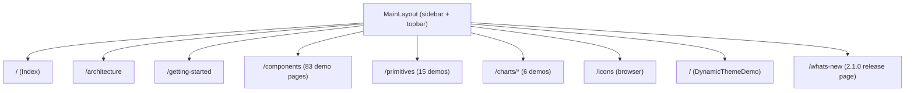

## 2. App shell & shared services

| Element | File | Responsibility |
|---------|------|----------------|
| `MainLayout` | `Shared/MainLayout.razor(.cs)` | Sidebar + topbar shell; hosts `<PortalHost/>`, theme + layout toggles, command search |
| `HorizontalNav` / `LayoutToggle` | `Shared/HorizontalNav.razor`, `Shared/LayoutToggle.razor` | Switch between vertical sidebar and horizontal top nav |
| `DarkModeToggle` | `Shared/DarkModeToggle.razor` | Adds/removes `.dark` on `<html>` |
| `CommandSearch` | `Shared/CommandSearch.razor` | Command-palette page jump |
| `ThemeService` | `Services/ThemeService.cs` | Current theme + light/dark state |
| `CollapsibleStateService` | `Services/CollapsibleStateService.cs` | Sidebar/collapsible persistence (localStorage) |
| `MockDataService` | `Services/MockDataService.cs` | Sample rows/series for DataTable + Chart demos (no DB) |
| `LayoutService` | `Services/LayoutService.cs` | Horizontal/vertical layout state |

There is **no data-access layer**: demo data comes entirely from `MockDataService` held in memory. Any code path that appears to read a database, call an API, or invoke a stored proc would be hallucinated — there is none in this repo.

## 3. Screen map

Each demo page lives under `demos/TrBlazeUI.Demo.Shared/Pages/` and composes one library component family. The full set is large — **117 `.razor` pages** in total (83 component demos + 15 primitive demos + 6 chart demos + icons + 5 top-level pages + `/whats-new` + 3 `/verify-*` test harnesses); the table below maps the representative/structural screens. Every `/components/{x}` page follows the same lineage shape: **demo page → `<Library component>` → primitive (if any) → JS interop / service**.

| Screen | Route | Demo page file | Library surface exercised | Lineage notes |
|--------|-------|----------------|---------------------------|---------------|
| Home | `/` | `Pages/Index.razor` | (overview) | Confirms CSS loaded |
| Architecture | `/architecture` | `Pages/Architecture.razor` | (static content) | — |
| Getting Started | `/getting-started` | `Pages/GettingStarted.razor` | (static content + snippets) | — |
| Dynamic Theme | (page) | `Pages/DynamicThemeDemo.razor` | `ThemeService`, CSS variables | Live theme variable editing |
| Components index | `/components` | `Pages/Components/Index.razor` | grid of 83 component links | — |
| Button | `/components/button` | `Pages/Components/ButtonDemo.razor` | `Button`, `ButtonIcon` | no primitive; pure styled |
| Sidebar | `/components/sidebar` | `Pages/Components/SidebarDemo.razor` | `Sidebar` (22 parts) → `CollapsibleStateService` + `sidebar.js` | ⚠ source trips REQ-NFR-005 (IDE0031) |
| Dialog | `/components/dialog` | `Pages/Components/DialogDemo.razor` | `Dialog` → Dialog primitive → `PortalHost` + `portal.js`/`focus-trap.js` | Nested Dialog and Select surfaces are reactive inside portalled content; renders ✓ + looks-right ✓ (runtime-confirmed 2026-08-25 at 1280px and 390px). |
| Select | `/components/select` | `Pages/Components/SelectDemo.razor` | `Select` → Select primitive → `positioning.js`/`select.js` | custom dropdown (overlay-safe). ✅ **TR-003 fixed (REQ-UI-014, 2026-07-22):** trigger `<button role="combobox">` now emits a default `aria-labelledby` → the `SelectValue` span (`SelectTrigger.razor` `GetDefaultLabelledBy()`), so it has an accessible name from first render; styled `SelectTrigger` adds an `AriaLabel` param. axe `button-name` = 0. |
| DataTable | `/components/datatable` | `Pages/Components/DataTableDemo.razor` | `DataTable` → `MockDataService` | sort/filter/paginate/select; **2.0.0**: `ShowToolbar` defaults `false` (opt-in), pagination gated on `ShouldShowPagination()` = `TotalItems > PageSize`. renders ✓ + looks-right ✓ (runtime-confirmed 2026-07-21, 40 rows real data) |
| Toolbar | `/components/toolbar` | `Pages/Components/ToolbarDemo.razor` | `Toolbar`/`ToolbarGroup`/`ToolbarButton`/`ToolbarToggleButton`/`ToolbarSeparator` | composes Button/DropdownMenu |
| RichTextEditor | `/components/rich-text-editor` | `Pages/Components/RichTextEditorDemo.razor` | `RichTextEditor` → `quill-interop.js` + HtmlSanitizer | sanitized HTML output |
| MarkdownEditor | `/components/markdown-editor` | `Pages/Components/MarkdownEditorDemo.razor` | `MarkdownEditor` → Markdig + `markdown-editor.js` | live preview |
| Primitives index | `/primitives` | `Pages/Primitives/Index.razor` | 15 headless-primitive demos | unstyled behavior + ARIA |
| Charts | `/charts/{area,bar,line,pie,radar,radial}` | `Pages/Charts/*ChartDemo.razor` | `Chart` → Blazor-ApexCharts → `MockDataService` | 6 types |
| Icons | `/icons` | `Pages/Icons/*` | `LucideIcon` / `HeroIcon` / `FeatherIcon` | generated `*IconData.cs` |
| What's new | `/whats-new` | `Pages/WhatsNew.razor` | live 2.1.0 examples (splatting, utility scale, retuned tokens) | release page added in 2.1.0. renders ✓ (2026-08-11) |
| Verify harnesses | `/verify-techieblog`, `/verify-ui016`, `/verify-ui014` | `Pages/VerifyTechieBlog.razor`, `VerifyUi016.razor`, `VerifyUi014.razor` | fixture pages driven by the matching `tests/verify/*.spec.js` | **not consumer-facing**; `/verify-techieblog` renders ✓ + looks-right ✓ (runtime-confirmed 2026-08-25, 76/76 checks). |

### 2.1.0 screens (added / changed by REQ-UI-017 — all runtime-verified 2026-08-11)

| Screen | Route | Demo page file | Library surface exercised | Lineage notes |
|--------|-------|----------------|---------------------------|---------------|
| Prose | `/components/prose` | `Pages/Components/ProseDemo.razor` | `Prose` | typographic wrapper for rendered markdown/HTML; wide tables scroll inside themselves (0px page overflow @390) |
| Stat | `/components/stat` | `Pages/Components/StatDemo.razor` | `StatTile`, `StatGroup` | pure styled; no primitive |
| Timeline | `/components/timeline` | `Pages/Components/TimelineDemo.razor` | `Timeline`, `TimelineItem` | pure styled |
| Stepper | `/components/stepper` | `Pages/Components/StepperDemo.razor` | `Stepper`, `StepperItem` | ⚠ `Current` cascades **by value** (not `IsFixed`) — that was the aria-current bug found while building this page |
| AnchorNav | `/components/anchor-nav` | `Pages/Components/AnchorNavDemo.razor` | `AnchorNav` → JS interop | in-page nav with scrollspy |
| SortableList | `/components/sortable-list` | `Pages/Components/SortableListDemo.razor` | `SortableList` | button-driven reordering — deliberately not drag-only, so it is keyboard/SR operable |
| PasswordStrength | `/components/password-strength` | `Pages/Components/PasswordStrengthDemo.razor` | `PasswordStrength` | pure styled meter |
| CodeBlock | `/components/code-block` | `Pages/Components/CodeBlockDemo.razor` | `CodeBlock` → clipboard JS | ⚠ copy falls back to `execCommand` off a secure origin, then reports "Press Ctrl+C" — never silently no-ops |
| CenteredPanel | `/components/centered-panel` | `Pages/Components/CenteredPanelDemo.razor` | `CenteredPanel` | layout wrapper |
| Rating | `/components/rating` | `Pages/Components/RatingDemo.razor` | `Rating` | 2.1.0: options are `<button role="radio">` with roving tabindex + literal `aria-checked`; `ReadOnly` → `role="img"`; new `Focusable` |
| Tabs | `/components/tabs` | `Pages/Components/TabsDemo.razor` | `Tabs` → Tabs primitive | 2.1.0: literal `aria-selected`; `aria-controls` only when a panel exists; `TabsContent` panel stays mounted (hidden) |
| Input / Textarea | `/components/input`, `/components/textarea` | `Pages/Components/InputDemo.razor`, `TextareaDemo.razor` | `Input`, `Textarea` → `TextValueSync` | 2.1.0: DOM value / render-tree value / parent value tracked separately so the Server echo can't overwrite typing; optional `DebounceMilliseconds` |
| NavigationMenu | `/components/navigation-menu` | `Pages/Components/NavigationMenuDemo.razor` | `NavigationMenu` | 2.1.0: top-level links Tab reachable; `menuitem` semantics only inside a real `role="menu"` popup |
| Item | `/components/item` | `Pages/Components/ItemDemo.razor` | `Item`, `ItemGroup`, `ItemSeparator` | 2.1.0: `role="listitem"` inside `ItemGroup`; separator leaves the a11y tree |
| Typography | `/components/typography` | `Pages/Components/TypographyDemo.razor` | `Typography*` | 2.1.0: `Size` replaces baked-in size classes; `ClassNames.cn` is variant-aware |

_(The remaining ~68 component demos and ~14 primitive demos follow the identical lineage shape; they are enumerated in the demo `Pages/Components/` and `Pages/Primitives/` folders and indexed in the BRD §9 feature catalog.)_

## 4. Library lineage — how a styled component resolves

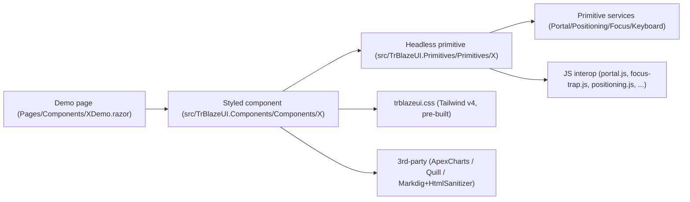

A reader chasing a bug starts at the demo page, drops into the styled component (`.razor` markup + `.razor.cs` logic), then into the primitive it composes (for behavior/ARIA), and finally into the relevant JS interop file or DI service. Symbols that don't resolve to a real file/component in `src/` are hallucinations — verify against the folders listed in `docs/TrBlazeUI-Architecture.md §4`.

## 5. Known issues

- **✅ RESOLVED 2026-08-31 — TfLens consumer feedback (`REQ-UI-019`), fixed and awaiting release.** Verified: Release 0/0, `ui-tflens` **44/44**, all regressions green (**166/166** executed checks). Every item below is fixed; the measurements are the *pre-fix* observations kept for the record, each followed by its post-fix measurement. Triaged from `docs/TfLens-TrBlazeUI-Feedback.md`; TfLens built against **2.0.0**, so **five entries are stale** (TR-002/003/013/020/023 — fixed by the 2.1.0 REQ-UI-017 sweep; the action is *publish/upgrade*, not re-fix) and four more are substantially fixed with a residual. **Reproduced live on the Server demo** (Release 0/0, headless Chromium):
  - **TR-009 (`REQ-UI-005`, blocker)** — `/components/datatable` "Custom Cell Templates": 500 records bound with `ShowPagination="false"` render **5 body rows and no pager**. → **Fixed:** `ShowPagination` now gates the data; the harness renders all 12 rows, no pager. `DataTable.razor.cs:409-413` slices `.Skip().Take()` unconditionally; `ShowPagination` gates only the pager chrome (`:564-567`). Any grid that turns pagination off is silently truncated to `InitialPageSize` (default 5).
  - **TR-014 (`REQ-UI-004`, blocker)** — `/components/alert-dialog`: `[role="alertdialog"]` count is **1 before Escape and 1 after**. → **Fixed:** now **1 → 0**, and the `CloseOnEscape="false"` opt-out still holds. `AlertDialogContent.razor:13-19` hard-codes `CloseOnEscape="false"` with no parameter to override. Separately, `Dialog` loses Escape after a content re-render (element-level handler + a focus trap that only handles Tab); the document-level helper `click-outside.js:97 onEscapeKey` exists with **zero call sites**.
  - **TR-018 (`REQ-UI-001`, major)** — `/components/collapsible`: a **closed** `[role="region"]` has its own rect height 0px but its inner child still reports a **20px** layout box, so a collapsed panel overlaps what follows. → **Fixed:** inner rect **0px**, sibling overlap **0px**, and it still animates open. `ForceMount` is hard-coded `true` to drive the grid height animation; `overflow:hidden` clips paint, never layout.
  - **TR-008 (`REQ-UI-009`, major)** — `lucide.json` ships `icons` (1,665) **and `aliases` (212)**; `GenerateIconData.ps1` reads only `$json.icons`, so every pre-rename spelling (`check-circle`, `alert-triangle`, `x-circle`, `help-circle`, …) resolves to nothing. → **Fixed at the generator:** 212/212 aliases emitted, 0 dangling, 0 missing-icon placeholders live. A question glyph *does* exist (`circle-question-mark`), contrary to the entry. `lucide.json` is also no longer packed into the nupkg.
  - **`REQ-FN-006`, doc** — `docs/TrBlazeUI-AI-Reference.md` §1's `_Imports` block omits **30 real component namespaces** including `TrBlazeUI.Components.Empty`, which the same file documents. The failure is an RZ10012 *warning* plus a literal `<empty>` element: it compiles, renders, and never errors. The reference also still forbids the `Alert`/`Button` `Icon` slot that now works, never mentions `AlertIcon`/`ButtonIcon`, has no `DataTableColumn` or `DialogContent` parameter table, and prescribes a lowercase `class` on `CardHeader` that wipes the component's own padding. → **Fixed:** 30 namespaces added (block now 79), three new parameter tables, icon guidance corrected, 9 lowercase-`class` occurrences swept.
  - **Two TfLens diagnoses were wrong and are corrected in the checklist:** `AlertDialog` *is* built on the Dialog primitive, and the chart components infer nothing by reflection — `ChartBase.Items` is a parameter **nothing reads**, which is the real reason an Items-only chart paints an empty box (TR-011a).
- **✅ RESOLVED 2026-08-25 — overlays (`REQ-UI-004`, TR-066/TR-067):** nested Dialog and Select surfaces now render reactively inside `DialogContent`; desktop/mobile mouse, keyboard, focus, render and visual gates pass in `tests/verify/ui-ui004.spec.js`.
- **⚠ UAT 2026-08-25 — attribute forwarding (`REQ-UI-012`):** `DatePicker` and `TimePicker` accept but drop unmatched attributes instead of forwarding them to the trigger; see TR-072.
- **⚠ UAT 2026-08-25 — post-2.0.2 component gaps (`REQ-UI-018`):** open findings cover Select initialization, delayed text echoes, Rating focus, Item mobile overflow, StatTile hooks, incomplete utility families, and AnchorNav fragment navigation; evidence is TR-068…TR-074 in `docs/TechieBlog-TrBlazeUI-Feedback.md`.
- **⚠ UAT 2026-08-25 — Codex packaging (`REQ-FN-010`):** clean NuGet-only consumers receive no library-owned `.codex/agents/trblazeui.toml`; see `docs/TechieFlow-TrBlazeUI-Feedback.md` TR-003.

- **Sidebar Release build error (REQ-NFR-005)** — _Resolved 2026-06-30._ The IDE0031 hits were event-accessor null guards where `?.` is illegal (CS0131); fixed via a justified one-rule `.editorconfig` downgrade. Release build is clean (0/0).
- **XML-doc coverage (REQ-FN-003)** — _Resolved 2026-06-30._ Now 100% on public members; CS1591 suppression removed and build-enforced.
- **NativeSelect in MAUI Hybrid overlays** — platform limitation (WebView2); use `<Select>` inside overlays (`docs/OldDocs/TrBlazeUI-Issues-Report-1.md` #2). Not a library defect.
- **Doc fix (found at runtime 2026-06-30):** the DataTable demo route is `/components/datatable` (no hyphen), not `/components/data-table` as earlier drafts stated — corrected above and in the UsageGuide.
- **DataTable default chrome / Dialog off-viewport / transparent popover (REQ-UI-016)** — _Resolved 2026-07-21._ AstroLyfe UAT findings TR-010/011/012: `ShowToolbar` now defaults `false` and pagination auto-hides for a single page; `DialogContent`/`AlertDialogContent` clamped to the viewport (`top` was −245/−305px, now +16px); library now ships zero-specificity `:where()` theme-token fallbacks so popovers stay opaque without host tokens. Verified 21/21 headless — `tests/verify/ui-ui016.spec.js`.
- **⚠ Breaking for consumers (2.0.0):** `DataTable.ShowToolbar` default flipped `true` → `false`. Any grid relying on the implicit toolbar must now pass `ShowToolbar="true"`.
- **✅ RESOLVED — SelectTrigger accessible name (TR-003, REQ-UI-014)** — _Fixed + verified 2026-07-22 (`*fix-issues`)._ The primitive `SelectTrigger` now emits a default `aria-labelledby` → the `SelectValue` span id (`GetDefaultLabelledBy()` → `SelectContext.ValueId`), giving the `<button role="combobox">` a non-empty accessible name from first render; it defers to a non-empty splatted `aria-label`/`aria-labelledby`. The styled `SelectTrigger` gains an `AriaLabel` param (emits `aria-label`, overrides the default per ARIA precedence). Verified on `/verify-ui014` (`tests/verify/ui-ui014.spec.js`, 8/8): axe `button-name` = **0 violations**; valued/placeholder/AriaLabel cases all named. Consumers can drop their per-Select `aria-label` workaround on upgrade to 2.0.1.
- **✅ TR-014 (AstroLyfe post-upgrade) — Dialog double-offset — DEFENSIVELY HARDENED** — _Fixed 2026-07-22 (owner-requested)._ The double-offset couldn't be reproduced on current source, but `DialogContent`/`AlertDialogContent` were switched from translate-based centering to **auto-margin centering** (`fixed inset-0 m-auto grid h-fit max-h-[calc(100vh-2rem)]`) so the top can never go above `y=0` regardless of any stray `transform`/`translate` −50% offset stacking — the clipping is now structurally impossible. Slide animations dropped for zoom+fade; Sheet/Drawer untouched; `trblazeui.css` regenerated. Verified 23/23 (`ui-ui016.spec.js`): settled `transform:none` **and** `translate:none`, `top=16px` @1366/1280/390; AlertDialog centers on-screen (`top=269`).
- **✅ RESOLVED — TR-066:** nested Dialog content renders inline within its containing document-level portal, avoiding stored-fragment disposal while preserving overlay positioning and focus containment. Runtime-confirmed 2026-08-25.
- **Log noise on circuit teardown (cosmetic, observed 2026-08-11).** Closing a browser tab that had an open `Select` logs `JSDisconnectedException` from `SelectContent.DisposeAsync` (`src/TrBlazeUI.Primitives/Primitives/Select/SelectContent.razor:287`). It is the standard Blazor Server dispose race — the circuit is already gone when `IJSObjectReference.DisposeAsync()` runs — and has no user-visible effect, but the throw should be caught so hosts don't log a stack trace per disconnect. Deferred, not a release blocker.
- **✅ RESOLVED 2.1.0 — the whole TechieBlog cycle (TR-001…TR-065, REQ-UI-017).** Catalog-wide attribute splatting (measured 344/344 + 59/59 by `tools/splat-audit`, not asserted); `Rating`/`Tabs`/`NavigationMenu`/`MarkdownEditor`/`Item` WCAG corrections; `Input`/`Textarea` keystroke loss on a Server circuit; `SelectValue` first-paint text; ordered portals so stacked dialogs are clickable by construction (TR-060); the full Tailwind utility scale in `trblazeui.css` (~906 KB min / ~97 KB gz, was ~88 KB); tokens re-solved as a contrast matrix by `tools/token-contrast.py` (18 failing pairings → 0, `--input` 1.26:1 → 3.11:1); and 9 new components. Verified 65/65 + 15/15 headless.
- **⚠ Breaking for consumers (2.1.0):** `Rating` options changed from `` to `<button role="radio">`; `TabsContent` always renders its panel element; the light `--input`/`--ring` and dark `--input`/`--accent`/`--destructive-foreground` tokens moved for contrast; the CSS bundle grew ~10×. See the CHANGELOG's "Behaviour changes to review before upgrading".
- Status is reflected in `docs/TrBlazeUI-Checklist.md` (all REQs terminal). Screens are runtime-verified — the 2.1.0 set on 2026-08-11 (25/25), earlier key screens with screenshots in `docs/screenshots/TrBlazeUI/`; run `*devguide TrBlazeUI --update` for a fresh sweep after the next change.

## 6. Runtime screenshots

Captured from the booted Blazor Server demo via headless Chromium (Playwright). These prove the as-built screens render with real data and correct layout.

### 6.1 The 2.1.0 surface (captured 2026-08-11 at handoff, 1366×900)

#### What's new — 2.1.0 release page (`/whats-new`)
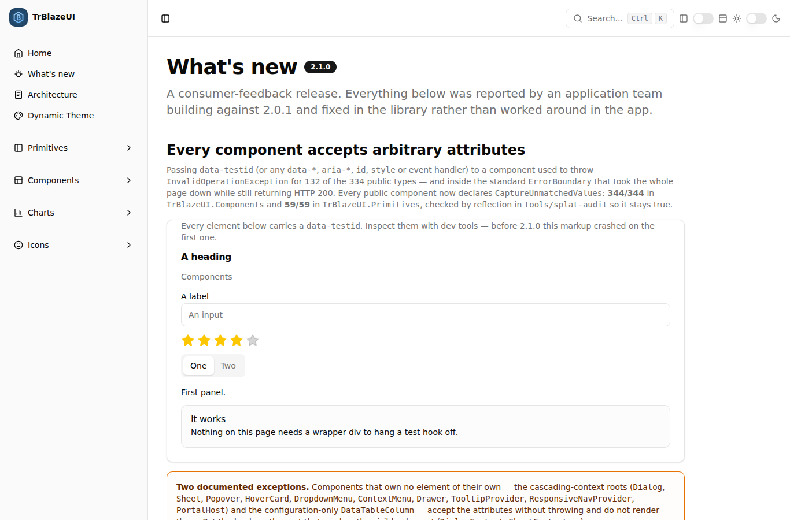

#### Prose (`/components/prose`)
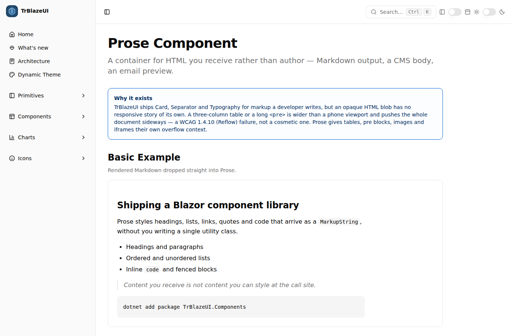

#### StatTile / StatGroup (`/components/stat`)
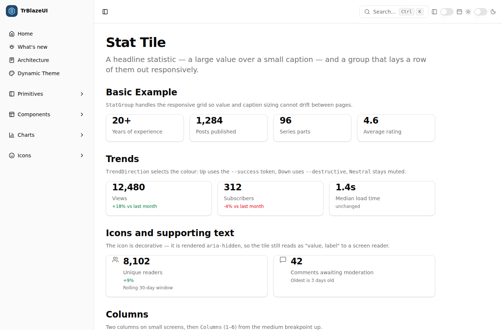

#### Timeline (`/components/timeline`)
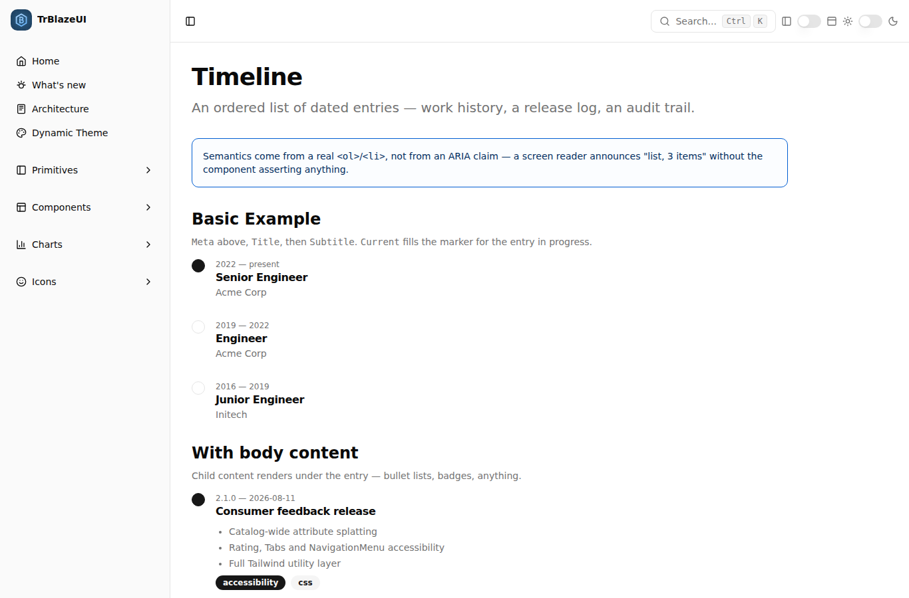

#### Stepper (`/components/stepper`)
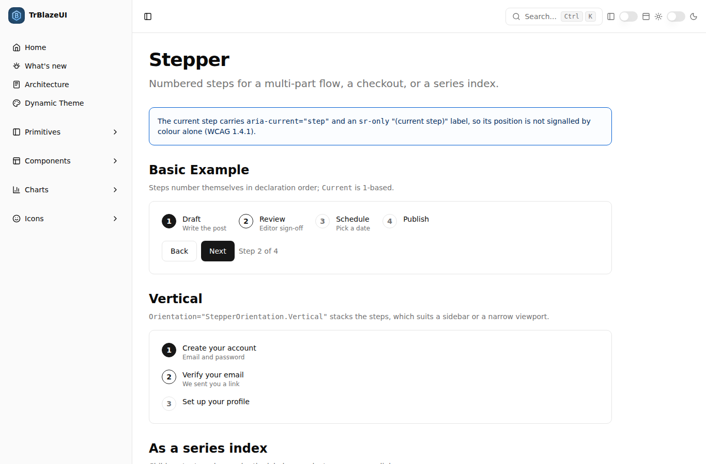

#### AnchorNav (`/components/anchor-nav`)
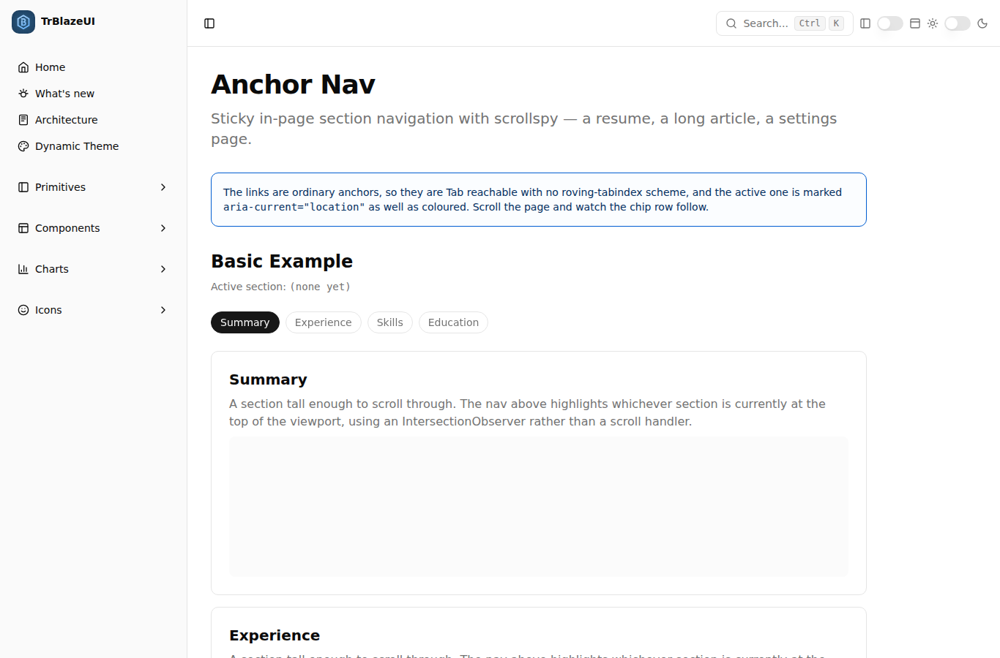

#### SortableList (`/components/sortable-list`)
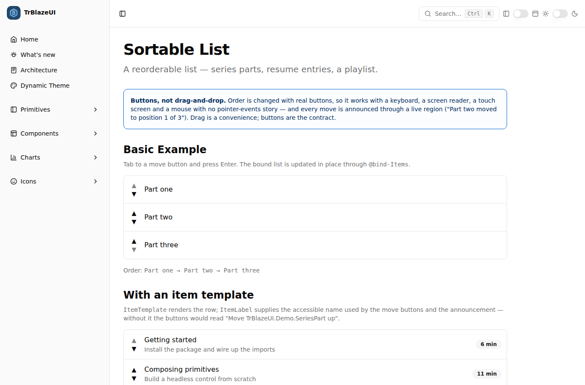

#### PasswordStrength (`/components/password-strength`)
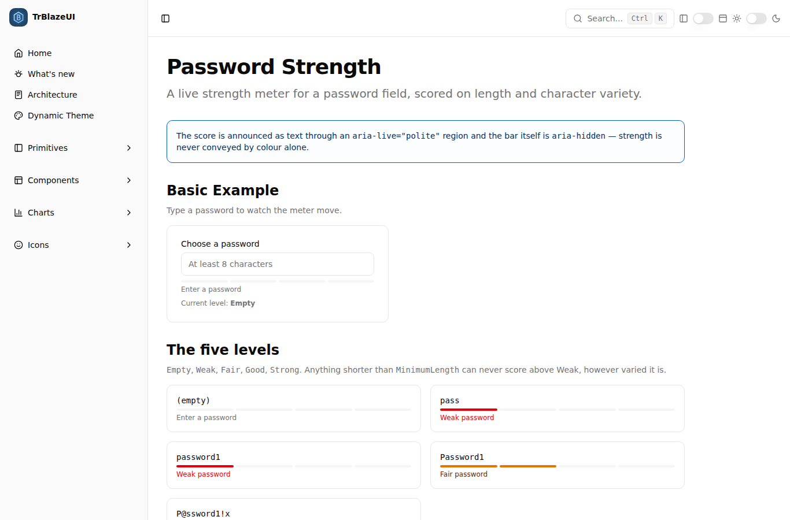

#### CodeBlock (`/components/code-block`)
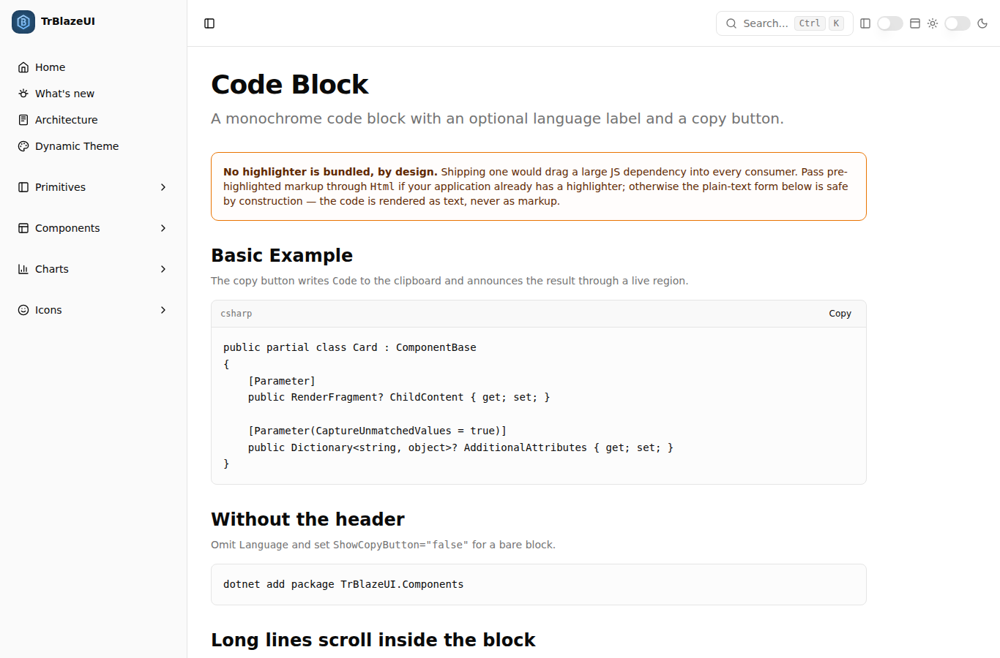

#### CenteredPanel (`/components/centered-panel`)
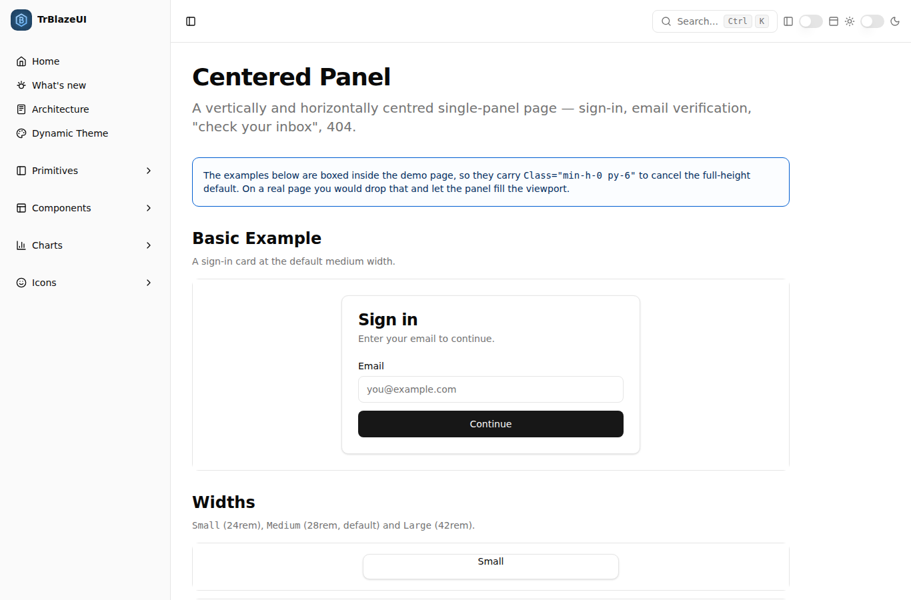

### 6.2 Earlier sampled key screens (2026-06-30; `datatable.png` recaptured 2026-07-21)

#### Home (`/`)
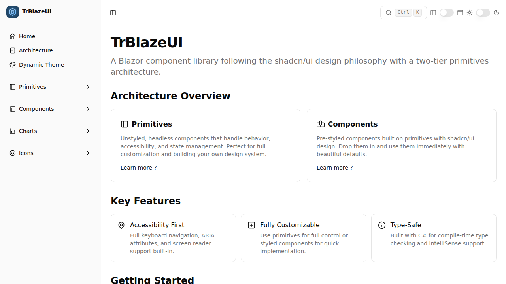

#### DataTable (`/components/datatable`)
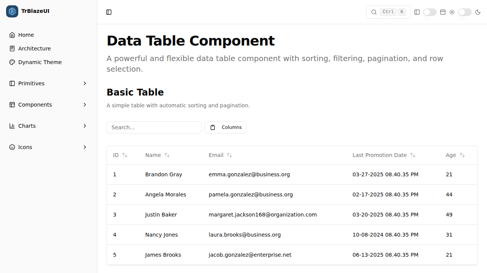

#### Bar Chart (`/charts/bar`)
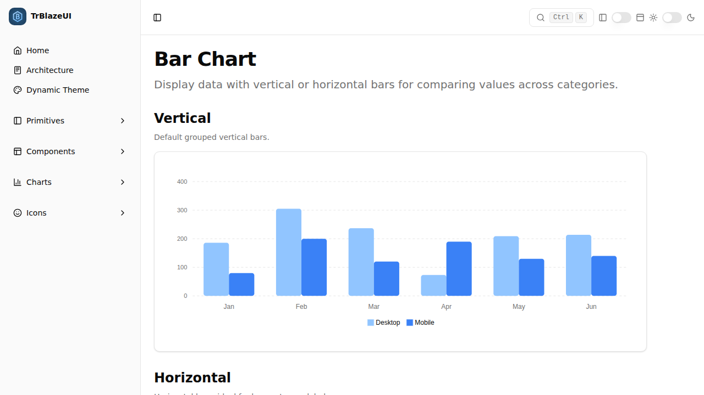

#### Toolbar (`/components/toolbar`)
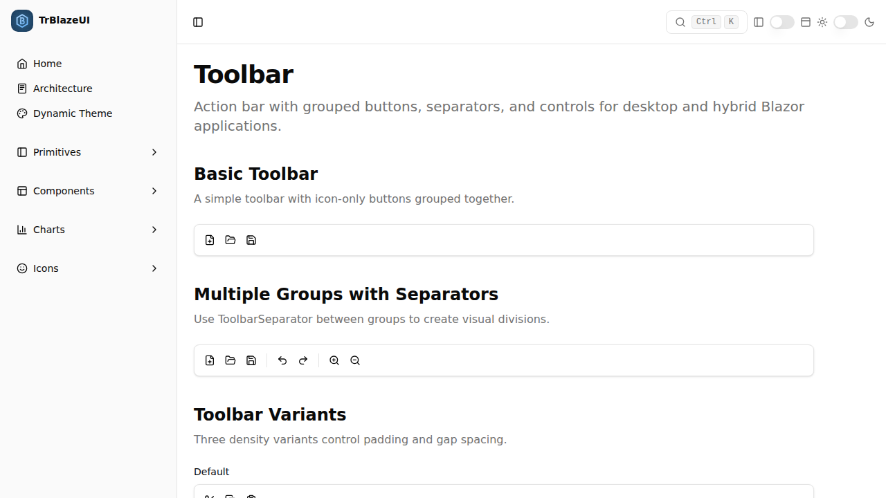

#### Icons (`/icons`)
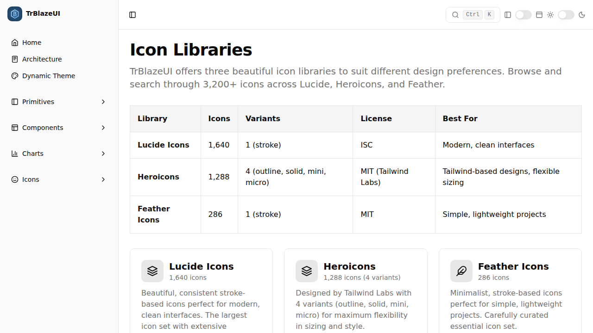

---
Last updated: 2026-08-11 (handoff, 2.1.0 as-built) · RUNTIME-VERIFIED — 25/25 on the 2.1.0 screens 2026-08-11, plus 65/65 + 15/15 REQ-UI-017 gates; screenshots for the earlier sampled key screens in docs/screenshots/TrBlazeUI/
