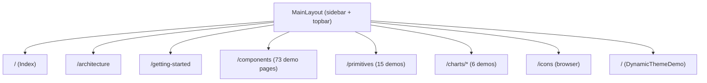
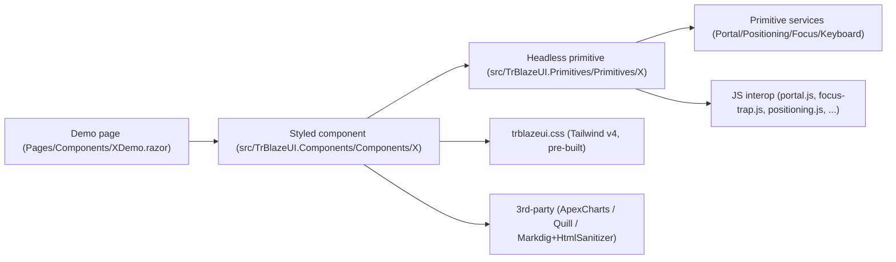

# TrBlazeUI — Developer Guide (as-built screen map)

**Last updated:** 2026-07-22
**Verification status:** ✅ **RUNTIME-VERIFIED (key screens sampled; DataTable / Dialog / Select / AlertDialog re-confirmed 2026-07-21).** The Blazor Server demo was booted and driven with headless Chromium (Playwright). Home, DataTable, Bar Chart, Toolbar and Icons were verified 2026-06-30 (screenshots in `docs/screenshots/TrBlazeUI/`). On **2026-07-21**, after the REQ-UI-016 fixes, `/components/datatable`, `/components/dialog`, `/components/select` and `/components/alert-dialog` were re-driven — all render their data, look right, and produce no console errors or horizontal overflow at 1366px and 390px (`tests/verify/ui-ui016.spec.js`, 21/21). `datatable.png` was recaptured because the toolbar default changed. The remaining ~80 component/primitive demo pages were not each individually driven; run `*verify ui` / `*devguide TrBlazeUI --update` for exhaustive per-screen confirmation.

> **What this document is.** The screen-by-screen, as-built map a developer uses to chase a bug or catch AI-hallucinated code. TrBlazeUI is a **component library with a demo application** and has **no database, no API, no stored procedures, and no auth** — so the usual *page → service → data-access → proc* lineage collapses to **demo page → demo-shared composition → library component → primitive → JS interop / service**. There is exactly one role: the **anonymous demo visitor**.

## Table of Contents

1. [Roles & navigation](#roles-navigation)
2. [App shell & shared services](#app-shell-shared-services)
3. [Screen map](#screen-map)
4. [Library lineage — how a styled component resolves](#library-lineage-how-a-styled-component-resolves)
5. [Known issues](#known-issues)

## 1. Roles & navigation

- **Role:** Anonymous demo visitor (no login). One sidebar navigation drives the whole app.
- **Hosts:** `Demo.Server` (5183/7172), `Demo.Wasm` (5184/7173), `Demo.Auto` (5185/7174) — all render the SAME `Demo.Shared` Razor Class Library, so the screen map below is host-independent.
- **Nav source:** `demos/TrBlazeUI.Demo.Shared/Shared/MainLayout.razor` (+ `.razor.cs`), with `HorizontalNav.razor` / `LayoutToggle.razor` for the horizontal/vertical layout switch, `DarkModeToggle.razor` for theme, and `CommandSearch.razor` for the command palette.

## 2. App shell & shared services

| Element | File | Responsibility |
|---------|------|----------------|
| `MainLayout` | `Shared/MainLayout.razor(.cs)` | Sidebar + topbar shell; hosts `<PortalHost/>`, theme + layout toggles, command search |
| `HorizontalNav` / `LayoutToggle` | `Shared/HorizontalNav.razor`, `Shared/LayoutToggle.razor` | Switch between vertical sidebar and horizontal top nav |
| `DarkModeToggle` | `Shared/DarkModeToggle.razor` | Adds/removes `.dark` on `<html>` |
| `CommandSearch` | `Shared/CommandSearch.razor` | Command-palette page jump |
| `ThemeService` | `Services/ThemeService.cs` | Current theme + light/dark state |
| `CollapsibleStateService` | `Services/CollapsibleStateService.cs` | Sidebar/collapsible persistence (localStorage) |
| `MockDataService` | `Services/MockDataService.cs` | Sample rows/series for DataTable + Chart demos (no DB) |
| `LayoutService` | `Services/LayoutService.cs` | Horizontal/vertical layout state |

There is **no data-access layer**: demo data comes entirely from `MockDataService` held in memory. Any code path that appears to read a database, call an API, or invoke a stored proc would be hallucinated — there is none in this repo.

## 3. Screen map

Each demo page lives under `demos/TrBlazeUI.Demo.Shared/Pages/` and composes one library component family. The full set is large (73 component demos + 15 primitive demos + 6 chart demos + icons + 5 top-level pages); the table below maps the representative/structural screens. Every `/components/{x}` page follows the same lineage shape: **demo page → `<Library component>` → primitive (if any) → JS interop / service**.

| Screen | Route | Demo page file | Library surface exercised | Lineage notes |
|--------|-------|----------------|---------------------------|---------------|
| Home | `/` | `Pages/Index.razor` | (overview) | Confirms CSS loaded |
| Architecture | `/architecture` | `Pages/Architecture.razor` | (static content) | — |
| Getting Started | `/getting-started` | `Pages/GettingStarted.razor` | (static content + snippets) | — |
| Dynamic Theme | (page) | `Pages/DynamicThemeDemo.razor` | `ThemeService`, CSS variables | Live theme variable editing |
| Components index | `/components` | `Pages/Components/Index.razor` | grid of 73 component links | — |
| Button | `/components/button` | `Pages/Components/ButtonDemo.razor` | `Button`, `ButtonIcon` | no primitive; pure styled |
| Sidebar | `/components/sidebar` | `Pages/Components/SidebarDemo.razor` | `Sidebar` (22 parts) → `CollapsibleStateService` + `sidebar.js` | ⚠ source trips REQ-NFR-005 (IDE0031) |
| Dialog | `/components/dialog` | `Pages/Components/DialogDemo.razor` | `Dialog` → Dialog primitive → `PortalHost` + `portal.js`/`focus-trap.js` | reactive portal refresh; **2.0.0**: `DialogContent`/`AlertDialogContent` clamped to `max-h-[calc(100vh-2rem)] overflow-y-auto` so a tall dialog can't render above the viewport. renders ✓ + looks-right ✓ (runtime-confirmed 2026-07-21) |
| Select | `/components/select` | `Pages/Components/SelectDemo.razor` | `Select` → Select primitive → `positioning.js`/`select.js` | custom dropdown (overlay-safe). ✅ **TR-003 fixed (REQ-UI-014, 2026-07-22):** trigger `<button role="combobox">` now emits a default `aria-labelledby` → the `SelectValue` span (`SelectTrigger.razor` `GetDefaultLabelledBy()`), so it has an accessible name from first render; styled `SelectTrigger` adds an `AriaLabel` param. axe `button-name` = 0. |
| DataTable | `/components/datatable` | `Pages/Components/DataTableDemo.razor` | `DataTable` → `MockDataService` | sort/filter/paginate/select; **2.0.0**: `ShowToolbar` defaults `false` (opt-in), pagination gated on `ShouldShowPagination()` = `TotalItems > PageSize`. renders ✓ + looks-right ✓ (runtime-confirmed 2026-07-21, 40 rows real data) |
| Toolbar | `/components/toolbar` | `Pages/Components/ToolbarDemo.razor` | `Toolbar`/`ToolbarGroup`/`ToolbarButton`/`ToolbarToggleButton`/`ToolbarSeparator` | composes Button/DropdownMenu |
| RichTextEditor | `/components/rich-text-editor` | `Pages/Components/RichTextEditorDemo.razor` | `RichTextEditor` → `quill-interop.js` + HtmlSanitizer | sanitized HTML output |
| MarkdownEditor | `/components/markdown-editor` | `Pages/Components/MarkdownEditorDemo.razor` | `MarkdownEditor` → Markdig + `markdown-editor.js` | live preview |
| Primitives index | `/primitives` | `Pages/Primitives/Index.razor` | 15 headless-primitive demos | unstyled behavior + ARIA |
| Charts | `/charts/{area,bar,line,pie,radar,radial}` | `Pages/Charts/*ChartDemo.razor` | `Chart` → Blazor-ApexCharts → `MockDataService` | 6 types |
| Icons | `/icons` | `Pages/Icons/*` | `LucideIcon` / `HeroIcon` / `FeatherIcon` | generated `*IconData.cs` |

_(The remaining ~60 component demos and ~14 primitive demos follow the identical lineage shape; they are enumerated in the demo `Pages/Components/` and `Pages/Primitives/` folders and indexed in the BRD §9 feature catalog. A runtime `--update` pass should stamp render-status per page.)_

## 4. Library lineage — how a styled component resolves

A reader chasing a bug starts at the demo page, drops into the styled component (`.razor` markup + `.razor.cs` logic), then into the primitive it composes (for behavior/ARIA), and finally into the relevant JS interop file or DI service. Symbols that don't resolve to a real file/component in `src/` are hallucinations — verify against the folders listed in `docs/TrBlazeUI-Architecture.md §4`.

## 5. Known issues

- **Sidebar Release build error (REQ-NFR-005)** — _Resolved 2026-06-30._ The IDE0031 hits were event-accessor null guards where `?.` is illegal (CS0131); fixed via a justified one-rule `.editorconfig` downgrade. Release build is clean (0/0).
- **XML-doc coverage (REQ-FN-003)** — _Resolved 2026-06-30._ Now 100% on public members; CS1591 suppression removed and build-enforced.
- **NativeSelect in MAUI Hybrid overlays** — platform limitation (WebView2); use `<Select>` inside overlays (`docs/OldDocs/TrBlazeUI-Issues-Report-1.md` #2). Not a library defect.
- **Doc fix (found at runtime 2026-06-30):** the DataTable demo route is `/components/datatable` (no hyphen), not `/components/data-table` as earlier drafts stated — corrected above and in the UsageGuide.
- **DataTable default chrome / Dialog off-viewport / transparent popover (REQ-UI-016)** — _Resolved 2026-07-21._ AstroLyfe UAT findings TR-010/011/012: `ShowToolbar` now defaults `false` and pagination auto-hides for a single page; `DialogContent`/`AlertDialogContent` clamped to the viewport (`top` was −245/−305px, now +16px); library now ships zero-specificity `:where()` theme-token fallbacks so popovers stay opaque without host tokens. Verified 21/21 headless — `tests/verify/ui-ui016.spec.js`.
- **⚠ Breaking for consumers (2.0.0):** `DataTable.ShowToolbar` default flipped `true` → `false`. Any grid relying on the implicit toolbar must now pass `ShowToolbar="true"`.
- **✅ RESOLVED — SelectTrigger accessible name (TR-003, REQ-UI-014)** — _Fixed + verified 2026-07-22 (`*fix-issues`)._ The primitive `SelectTrigger` now emits a default `aria-labelledby` → the `SelectValue` span id (`GetDefaultLabelledBy()` → `SelectContext.ValueId`), giving the `<button role="combobox">` a non-empty accessible name from first render; it defers to a non-empty splatted `aria-label`/`aria-labelledby`. The styled `SelectTrigger` gains an `AriaLabel` param (emits `aria-label`, overrides the default per ARIA precedence). Verified on `/verify-ui014` (`tests/verify/ui-ui014.spec.js`, 8/8): axe `button-name` = **0 violations**; valued/placeholder/AriaLabel cases all named. Consumers can drop their per-Select `aria-label` workaround on upgrade to 2.0.1.
- **✅ TR-014 (AstroLyfe post-upgrade) — Dialog double-offset — DEFENSIVELY HARDENED** — _Fixed 2026-07-22 (owner-requested)._ The double-offset couldn't be reproduced on current source, but `DialogContent`/`AlertDialogContent` were switched from translate-based centering to **auto-margin centering** (`fixed inset-0 m-auto grid h-fit max-h-[calc(100vh-2rem)]`) so the top can never go above `y=0` regardless of any stray `transform`/`translate` −50% offset stacking — the clipping is now structurally impossible. Slide animations dropped for zoom+fade; Sheet/Drawer untouched; `trblazeui.css` regenerated. Verified 23/23 (`ui-ui016.spec.js`): settled `transform:none` **and** `translate:none`, `top=16px` @1366/1280/390; AlertDialog centers on-screen (`top=269`).
- Status is reflected in `docs/TrBlazeUI-Checklist.md` (all REQs terminal). Key screens are runtime-verified with screenshots in `docs/screenshots/TrBlazeUI/`; run `*devguide TrBlazeUI --update` for exhaustive per-screen confirmation across all ~80 demo pages.

## 6. Runtime screenshots (sampled, 2026-06-30)

Captured from the booted Blazor Server demo via headless Chromium (Playwright). These prove the as-built screens render with real data and correct layout.

### Home (`/`)

### DataTable (`/components/datatable`)

### Bar Chart (`/charts/bar`)

### Toolbar (`/components/toolbar`)

### Icons (`/icons`)

---
Last updated: 2026-06-30 · RUNTIME-VERIFIED for sampled key screens (screenshots in docs/screenshots/TrBlazeUI/); run `*devguide --update` for exhaustive coverage
